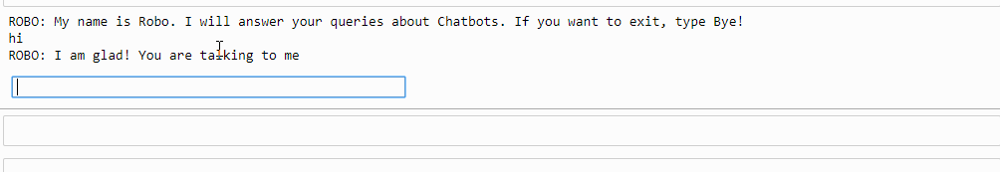

Crear un chatbot puede transformar la atención al cliente, automatizar tareas y mejorar la experiencia digital. Aquí tienes algunas de las mejores herramientas para crear chatbots, tanto con inteligencia artificial como sin necesidad de programar:

# Herramientas destacadas para crear chatbots

## 1. Tidio
Ideal para pequeñas y medianas empresas.

Editor visual muy intuitivo.

Integración con chat en vivo y automatización de respuestas.

Perfecto para atención al cliente y generación de leads. 🔗 Guía de plataformas para crear chatbots – Tidio

## 2. Landbot.io

No requiere programación.

Se integra fácilmente con WhatsApp, Slack, Facebook Messenger, Google Sheets, etc.

Ideal para marketing, ventas y soporte.

Ofrece plantillas prediseñadas y estadísticas de conversación. 🔗 Lista de creadores de chatbot – Geekflare

## 3. HubSpot Chatbot Builder

**Gratuito y sin límite de tiempo.**

Integrado con el CRM de HubSpot.

Automatiza tareas como agendar reuniones, calificar leads y responder consultas.

Muy útil para empresas que ya usan HubSpot. 🔗 Chatbot de IA – HubSpot

## 4. ManyChat

Especializado en chatbots para redes sociales (Facebook Messenger, Instagram, WhatsApp).

Muy útil para e-commerce y campañas de marketing.

Ofrece automatización de mensajes y segmentación de audiencia. 🔗 Incluido en la guía de Tidio

## 5. Chatfuel

Enfocado en redes sociales y atención al cliente.

Permite crear bots sin código.

Ideal para empresas que buscan automatizar respuestas en Facebook o Telegram. 🔗 También en la lista de Tidio

¿Quieres que te recomiende una herramienta específica según el tipo de negocio o canal que tienes en mente (web, WhatsApp, redes sociales)? También puedo ayudarte a diseñar el flujo de conversación inicial.

# HubSpot Chatbot Builder 
Ofrece una versión gratuita que permite a cualquier empresa crear chatbots sin necesidad de conocimientos técnicos ni tarjeta de crédito.

¿Qué puedes hacer con la versión gratuita?

Crear chatbots personalizados con plantillas y editor visual.

Automatizar tareas como agendar reuniones, calificar leads y responder preguntas frecuentes.

Integrar el chatbot con el CRM de HubSpot, para ofrecer respuestas personalizadas basadas en datos reales.

Atender clientes 24/7 en tu sitio web, y derivar a agentes humanos cuando sea necesario.

Configurar el chatbot en español y adaptarlo a tu marca y estilo de comunicación.

Enlaces para ampliar información

[Página oficial de HubSpot Chatbot Builder](https://www.hubspot.es/products/crm/chatbot-builder)

[Tutorial para crear un chatbot en español con HubSpot](https://www.inboundcycle.com/blog-de-inbound-marketing/como-crear-chatbot-espanol-hubspot)

¿Quieres que te ayude a diseñar el flujo de conversación inicial para tu chatbot o elegir la plantilla más adecuada según tu sector? Estoy listo para ayudarte a ponerlo en marcha.

# Ejemplo de flujo de conversación para el chatbot de Medias Asensio

## Objetivo del chatbot:
	Atender consultas básicas de clientes.

	Guiar al usuario en la compra online.

	Resolver dudas frecuentes sobre productos, envíos y tiendas físicas.

	Derivar a un agente humano si es necesario.

## Flujo de conversación inicial

## Inicio

```plaintext
¡Hola! 👋 Bienvenido a Medias Asensio. ¿En qué podemos ayudarte hoy?
```

Opciones principales (botones o respuestas rápidas)
	Ver catálogo de productos

	Consultar estado de mi pedido

	Información sobre tiendas físicas

	Hablar con un agente

## Si el usuario elige “Ver catálogo de productos”

```plaintext
Perfecto. ¿Qué tipo de producto estás buscando?
```
	Medias de mujer

	Calcetines de hombre

	Packs promocionales

	Ver todo el catálogo

Aquí puedes enlazar directamente a secciones de la tienda online.

## Si el usuario elige “Consultar estado de mi pedido”

```plaintext
Por favor, introduce tu número de pedido para comprobar el estado.
```
El chatbot puede conectarse al sistema de pedidos si está integrado con el CRM.

## Si el usuario elige “Información sobre tiendas físicas”

```plaintext
Tenemos tiendas en Telde (Gran Canaria), Santa Cruz y Arona (Tenerife). ¿Quieres ver horarios, dirección o cómo llegar?
```

Ver horarios

Ver ubicación

Contactar con la tienda

## Si el usuario elige “Hablar con un agente”

```plaintext
Un momento, te conectamos con uno de nuestros compañeros. ⏳
```

Aquí se activa el chat en vivo o se deriva a un formulario de contacto si no hay agentes disponibles.

## Consejos para configurar el chatbot en HubSpot

	Usa plantillas prediseñadas para atención al cliente.

	Activa el modo multilingüe si tienes clientes internacionales.

	Integra el chatbot con el CRM de HubSpot para personalizar respuestas.

	Configura mensajes de bienvenida y respuestas automáticas para fuera de horario.


¿Quieres que te ayude a redactar mensajes específicos para promociones, devoluciones o atención postventa? También puedo ayudarte a definir el tono de voz del chatbot según la identidad de marca.


# ChatBot

¡Buena pregunta! Crear un chatbot con Python es totalmente posible y muy flexible. Puedes hacerlo desde algo básico hasta sistemas avanzados con inteligencia artificial. Aquí te muestro cómo empezar paso a paso:

## 1. Chatbot básico con ChatterBot
ChatterBot es una librería ideal para principiantes. Permite entrenar un bot con ejemplos de conversación sin necesidad de programar reglas complejas.

## Ejemplo simple:

```python
from chatterbot import ChatBot
from chatterbot.trainers import ListTrainer

# Crear el chatbot
bot = ChatBot('Asistente')

# Entrenamiento con frases básicas
trainer = ListTrainer(bot)
conversacion = [
    'Hola',
    'Hola, ¿cómo puedo ayudarte?',
    '¿Cuál es tu nombre?',
    'Me llamo Asistente, encantado de conocerte.'
]
trainer.train(conversacion)

# Probar el chatbot
print(bot.get_response('Hola'))
```
Puedes ampliar el entrenamiento con más frases o conectarlo a una interfaz web.

## 2. Chatbot avanzado con Rasa
Rasa es una plataforma profesional en Python para crear chatbots con procesamiento de lenguaje natural (NLP), gestión de contexto y despliegue en producción.

Permite crear flujos de conversación complejos.

Se integra con canales como WhatsApp, Telegram o web.

Requiere conocimientos más avanzados, pero es muy potente.

## 3. Procesamiento de texto con SpaCy o NLTK
Si quieres que tu bot entienda mejor el lenguaje humano, puedes usar librerías como:

SpaCy: para reconocimiento de entidades, análisis sintáctico, etc.

NLTK: para tokenización, clasificación de texto y respuestas automáticas.

## Recursos útiles para aprender

[Guía paso a paso para crear un chatbot en Python – KeepCoding](https://keepcoding.io/blog/como-crear-un-chatbot-en-python/)

[Tutorial de ChatterBot en español – DataCamp](https://www.datacamp.com/es/tutorial/building-a-chatbot-using-chatterbot)

[Ejemplo con NLTK – CódigoFuente.org](https://www.codigofuente.org/crear-chatbot-basico-python/)

¿Quieres que te ayude a diseñar un flujo de conversación específico para tu chatbot en Python o elegir la mejor librería según tu nivel? Estoy listo para ayudarte a construirlo paso a paso.

# Installing NLTK Data
After installing the NLTK package, please do install the necessary datasets/models for specific functions to work.

If you’re unsure of which datasets/models you’ll need, you can install the “popular” subset of NLTK data, on the command line type `python -m nltk.downloader popular`, or in the Python interpreter `import nltk; nltk.download('popular')`

[For details, see](https://www.nltk.org/data.html)

# NLTK: Una breve introducción
NLTK (Natural Language Toolkit) es una plataforma líder para crear programas Python para trabajar con datos en lenguaje humano. Proporciona interfaces fáciles de usar para más de 50 recursos corporales y léxicos , como WordNet, junto con un conjunto de bibliotecas de procesamiento de texto para clasificación, tokenización, derivación, etiquetado, análisis y razonamiento semántico, envoltorios para bibliotecas de PNL de potencia industrial.

NLTK ha sido llamada “una herramienta maravillosa para la enseñanza y el trabajo en lingüística computacional con Python” y “una biblioteca increíble para jugar con lenguaje natural”.

El procesamiento del lenguaje natural con Python proporciona una introducción práctica a la programación para el procesamiento del lenguaje. Recomiendo este libro a las personas que comienzan en PNL con Python.

## Descargando e instalando NLTK

**Instalar NLTK:** ejecutar `pip install nltk`
**Instalación de prueba:** ejecutar python y luego escribir `import nltk`
Para obtener instrucciones específicas de la plataforma, pues acudir a este enlace [aquí](#Installing-NLTK-Data) .

## Instalación de paquetes NLTK
Importar NLTK y ejecutar `nltk.download()`.Esto abrirá el descargador de NLTK desde donde puedes elegir los corpus y modelos para descargar. También puedes descargar todos los paquetes a la vez.

## Preprocesamiento de texto con NLTK

El problema principal con los datos de texto es que todo está en formato de texto (cadenas). Sin embargo, los algoritmos de aprendizaje automático necesitan algún tipo de vector de características numéricas para realizar la tarea. Entonces, antes de comenzar con cualquier proyecto de PNL, debemos preprocesarlo para que sea ideal para trabajar. El preprocesamiento de texto básico incluye:

Convertir todo el texto en mayúsculas o minúsculas , para que el algoritmo no trate las mismas palabras en diferentes casos como diferentes.

**Tokenización :** Tokenización es solo el término usado para describir el proceso de conversión de las cadenas de texto normales en una lista de tokens, es decir, las palabras que realmente queremos. El tokenizador de oraciones se puede usar para encontrar la lista de oraciones y el tokenizador de palabras se puede usar para encontrar la lista de palabras en cadenas.
El paquete de datos NLTK incluye un **tokenizer Punkt** previamente entrenado para el inglés.

Eliminar ruido, es decir, todo lo que no esté en un número o letra estándar.

**Eliminando las Stop words.** A veces, algunas palabras extremadamente comunes que parecen tener poco valor para ayudar a seleccionar documentos que coinciden con las necesidades de un usuario se excluyen por completo del vocabulario. Estas palabras se llaman **Stop words**.

**Generación de derivaciones:** derivación es el proceso de reducir las palabras con inflexión (o algunas veces derivadas) a su forma de raíz, base o raíz, generalmente una forma de palabra escrita. Ejemplo si tuviéramos que detener las siguientes palabras: “Pan” “panadero, “y panaderia”, el resultado sería una sola palabra “pan”.

**Lemmatización:** una ligera variante de la derivación es la lematización. La principal diferencia entre estos es que, la derivación a menudo puede crear palabras inexistentes, mientras que los lemas son palabras reales. Por lo tanto, su raíz, es decir, la palabra con la que termina, no es algo que pueda buscar en un diccionario, pero sí puede buscar un lema. Algunos ejemplos de Lemmatización son que “correr” es una forma básica de palabras como “ccorriendo” o “corrió” o que la palabra “mejor” y “bueno” están en el mismo lema, por lo que se consideran iguales.

# Bag of Words
Después de la fase de preprocesamiento inicial, necesitamos transformar el texto en un vector significativo (o matriz) de números. La bolsa de palabras es una representación de texto que describe la aparición de palabras dentro de un documento. Se trata de dos cosas:

	Un vocabulario de palabras conocidas.
	Una medida de la presencia de palabras conocidas.

¿Por qué se llama una “bag” of words? Esto se debe a que cualquier información sobre el orden o la estructura de las palabras en el documento se descarta y al modelo solo le preocupa si las palabras conocidas aparecen en el documento, no donde aparecen en el documento.

La intuición detrás de esta Bolsa de palabras es que los documentos son similares si tienen un contenido similar. Además, podemos aprender algo sobre el significado del documento solo a partir de su contenido.

Por ejemplo, si nuestro diccionario contiene las palabras {Learning, is, the, not, great}, y queremos vectorizar el texto “Learning is great”, tendríamos el siguiente vector: (1, 1, 0, 0, 1).

## Enfoque TF-IDF

Un problema con el enfoque de la Bolsa de Palabras es que las palabras muy frecuentes comienzan a dominar en el documento (por ejemplo, mayor puntuación), pero es posible que no contengan tanto “contenido informativo”. Además, dará más peso a los documentos más largos que a los más cortos.

Un enfoque es volver a escalar la frecuencia de las palabras según la frecuencia con la que aparecen en todos los documentos, de manera que se penalicen las puntuaciones de las palabras frecuentes como “the” que también son frecuentes en todos los documentos. Este enfoque de puntuación se denomina **Frecuencia de documentos de frecuencia inversa a término** , o **TF-IDF** para abreviar, donde:

**Frecuencia de término :** es una puntuación de la frecuencia de la palabra en el documento actual.
```bash
TF = (Number of times term t appears in a document)/(Number of terms in the document)
```
**Frecuencia de documentos inversa :** es una puntuación de cuán rara es la palabra entre los documentos.
```bash
IDF = 1+log(N/n), where, N is the number of documents and n is the number of documents a term t has appeared in.
```

El peso de **Tf-idf** es un peso que se usa a menudo en la recuperación de información y la minería de texto. Este peso es una medida estadística que se utiliza para evaluar la importancia de una palabra para un documento de una colección o un corpus.

Ejemplo:

Considera un documento que contiene 100 palabras en donde la palabra “teléfono” aparece 5 veces.

El término **frecuencia** (es decir, tf) para teléfono es entonces (5/100) = 0.05. Ahora, supongamos que tenemos 10 millones de documentos y la palabra teléfono aparece en mil de estos. Luego, la frecuencia del documento inverso (es decir, IDF) se calcula como log (10,000,000 / 1,000) = 4. Por lo tanto, el peso de **Tf-IDF** es el producto de estas cantidades: 0.05 * 4 = 0.20.

**Tf-IDF** puede implementarse en **scikit learn** como:

desde `sklearn.feature_extraction.text import TfidfVectorizer`

## Similitud coseno

**TF-IDF** es una transformación aplicada a los textos para obtener dos vectores de valor real en el espacio vectorial. Luego podemos obtener la similitud de coseno de cualquier par de vectores tomando su producto puntual y dividiéndolo por el producto de sus normas. Eso produce el coseno del ángulo entre los vectores. La similitud de coseno es una medida de similitud entre dos vectores distintos de cero. Usando esta fórmula podemos descubrir la similitud entre dos documentos d1 y d2.
```bash
Cosine Similarity (d1, d2) = Dot product(d1, d2) / ||d1|| * ||d2||
```
Donde d1, d2 son dos vectores que no son cero.

Para una explicación detallada y un ejemplo práctico de TF-IDF y Cosine Similarity, consulta el documento a continuación.

## Tf-Idf and Cosine similarity
In the year 1998 Google handled 9800 average search queries every day. In 2012 this number shot up to 5.13 billion…
janav.wordpress.com

**Ahora tenemos una idea clara del proceso de la PNL. Es hora de que lleguemos a nuestra tarea real, es decir, la creación de nuestro chatbot.** Llamaremos a nuestro **chatbot ‘ROBO🤖’**.

Importando las librerías necesarias.
```bash
import nltk  import numpy as np  import random  import string # to process standard python strings
```

# Cuerpo

Para nuestro ejemplo, usaremos la página de [Wikipedia para chatbots](https://en.wikipedia.org/wiki/Chatbot) como nuestro corpus. Copia el contenido de la página y colócalo en un archivo de texto llamado ‘chatbot.txt’. Si lo prefieres, puedes utilizar otro corpus.

## Leyendo en los datos

Leeremos en el archivo **corpus.txt** y convertiremos el corpus completo en una lista de oraciones y una lista de palabras para un procesamiento previo adicional.
```bash
f=open('chatbot.txt','r',errors = 'ignore')raw=f.read()raw=raw.lower()# converts to lowercasenltk.download('punkt') # first-time use only  nltk.download('wordnet') # first-time use onlysent_tokens = nltk.sent_tokenize(raw)# converts to list of sentences   word_tokens = nltk.word_tokenize(raw)# converts to list of words
```
Veamos un ejemplo de sent_tokens y word_tokens

```bash
sent_tokens[:2]  ['a chatbot (also known as a talkbot, chatterbot, bot, im bot, interactive agent, or artificial conversational entity) is a computer program or an artificial intelligence which   conducts a conversation via auditory or textual methods.',   'such programs are often designed to convincingly simulate how a human would behave as a conversational partner, thereby passing the turing test.']  word_tokens[:2]  ['a', 'chatbot', '(', 'also', 'known']
```
**Pre-procesamiento del texto crudo**

Ahora definiremos una función llamada LemTokens que tomará como entrada los tokens y devolverá tokens normalizados.
```bash
lemmer = nltk.stem.WordNetLemmatizer()  #WordNet is a semantically-oriented dictionary of English included in NLTK.def LemTokens(tokens):  return [lemmer.lemmatize(token) for token in tokens]  remove_punct_dict = dict((ord(punct), None) for punct in string.punctuation)  def LemNormalize(text):  return LemTokens(nltk.word_tokenize(text.lower().translate(remove_punct_dict)))
```

**Coincidencia de palabras clave**

A continuación, definiremos una función para un saludo a través el bot, es decir, si la entrada de un usuario es un saludo, el bot devolverá una respuesta de saludo. ELIZA usa una palabra clave simple que coincide con los saludos. Utilizaremos el mismo concepto aquí.
```bash
GREETING_INPUTS = ("hello", "hi", "greetings", "sup", "what's up","hey",)  GREETING_RESPONSES = ["hi", "hey", "*nods*", "hi there", "hello", "I am glad! You are talking to me"]def greeting(sentence):     for word in sentence.split():   if word.lower() in GREETING_INPUTS:   return random.choice(GREETING_RESPONSES)
```
**Generando respuestas**

Para generar una respuesta de nuestro bot para preguntas de entrada, se utilizará el concepto de similitud de documentos. Entonces comenzamos importando los módulos necesarios.

Desde la biblioteca scikit learn, importa el **vectorizador TFidf** para convertir una colección de documentos en bruto en una matriz de características TF-IDF.
```bash
from sklearn.feature_extraction.text import TfidfVectorizer
```

Además, importa el módulo de similitud de coseno desde la biblioteca de aprendizaje de scikit
```bash
from sklearn.metrics.pairwise import cosine_similarity
```
Esto se usará para encontrar la similitud entre las palabras ingresadas por el usuario y las palabras en el corpus. Esta es la implementación más simple posible de un chatbot.

Definimos una respuesta de función que busca la expresión del usuario para una o más palabras clave conocidas y devuelve una de las varias repsuestas posibles. Si no encuentra la entrada que coincide con ninguna de las palabras clave, devuelve una respuesta: “¡Lo siento! No te entiendo.
```bash
def response(user_response):   robo_response=''   sent_tokens.append(user_response)TfidfVec = TfidfVectorizer(tokenizer=LemNormalize, stop_words='english')   tfidf = TfidfVec.fit_transform(sent_tokens)   vals = cosine_similarity(tfidf[-1], tfidf)   idx=vals.argsort()[0][-2]   flat = vals.flatten()   flat.sort()   req_tfidf = flat[-2]if(req_tfidf==0):   robo_response=robo_response+"I am sorry! I don't understand you"   return robo_response   else:   robo_response = robo_response+sent_tokens[idx]   return robo_response
```

Finalmente, alimentaremos las líneas que queremos que diga nuestro robot al iniciar y finalizar una conversación, según la información del usuario.

```bash
flag=True  print("ROBO: My name is Robo. I will answer your queries about Chatbots. If you want to exit, type Bye!")while(flag==True):   user_response = input()   user_response=user_response.lower()   if(user_response!='bye'):   if(user_response=='thanks' or user_response=='thank you' ):   flag=False   print("ROBO: You are welcome..")   else:   if(greeting(user_response)!=None):   print("ROBO: "+greeting(user_response))   else:   print("ROBO: ",end="")   print(response(user_response))   sent_tokens.remove(user_response)   else:   flag=False   print("ROBO: Bye! take care..")
```

Y eso es todo. Tenemos el codificado de nuestro primer chatbot en NLTK. Puedes encontrar el código completo con el corpus aquí . Ahora, veamos cómo interactúa con los humanos:



Esto no fue tan malo como parece. Incluso aunque el chatbot no pudo dar una respuesta satisfactoria a algunas preguntas, hizo un trabajo excelente en otras.

## Conclusión

Aunque es un bot muy simple con casi ninguna habilidad cognitiva, es una buena manera de entrar en la PNL y aprender sobre los chatbots. Aunque ‘ROBO’ responde a las sugerencias del usuario. No engañará a sus amigos y, para un sistema de producción, querrá considerar una de las plataformas o marcos de bots existentes, pero este ejemplo lo ayudará a pensar en el diseño y el desafío de crear un chatbot. Internet está inundado de recursos. y después de leer este artículo, estoy seguro de que desearás crear un chatbot propio.

# Resumen Estructurado.

Aquí te dejo un resumen estructurado y algunos consejos adicionales para que puedas sacarle el máximo provecho:

## Instalación y configuración de NLTK

Instala NLTK con:

```bash
pip install nltk
```
Verifica la instalación:

```python
import nltk
```
Descarga los recursos necesarios:

```python
nltk.download('punkt')
nltk.download('wordnet')
```

## Preprocesamiento de texto

Tokenización de oraciones y palabras:

```python
sent_tokens = nltk.sent_tokenize(raw)
word_tokens = nltk.word_tokenize(raw)
```

Lematización y normalización:

```python
lemmer = nltk.stem.WordNetLemmatizer()

def LemTokens(tokens):
    return [lemmer.lemmatize(token) for token in tokens]

remove_punct_dict = dict((ord(punct), None) for punct in string.punctuation)

def LemNormalize(text):
    return LemTokens(nltk.word_tokenize(text.lower().translate(remove_punct_dict)))
```

## TF-IDF y Similitud Coseno

TF-IDF con scikit-learn:

```python
from sklearn.feature_extraction.text import TfidfVectorizer
TfidfVec = TfidfVectorizer(tokenizer=LemNormalize, stop_words='english')
tfidf = TfidfVec.fit_transform(sent_tokens)
```

Similitud coseno:

```python
from sklearn.metrics.pairwise import cosine_similarity
vals = cosine_similarity(tfidf[-1], tfidf)
```

## Construcción del chatbot ROBO

Respuestas a saludos:

```python

GREETING_INPUTS = ("hello", "hi", "greetings", "sup", "what's up","hey",)
GREETING_RESPONSES = ["hi", "hey", "*nods*", "hi there", "hello", "I am glad! You are talking to me"]

def greeting(sentence):
    for word in sentence.split():
        if word.lower() in GREETING_INPUTS:
            return random.choice(GREETING_RESPONSES)
```

## Generación de respuestas:

```python
def response(user_response):
    robo_response = ''
    sent_tokens.append(user_response)
    tfidf = TfidfVec.fit_transform(sent_tokens)
    vals = cosine_similarity(tfidf[-1], tfidf)
    idx = vals.argsort()[0][-2]
    flat = vals.flatten()
    flat.sort()
    req_tfidf = flat[-2]
    if req_tfidf == 0:
        robo_response += "I am sorry! I don't understand you"
    else:
        robo_response += sent_tokens[idx]
    return robo_response
```

## Bucle principal del chatbot:

```python
flag = True
print("ROBO: My name is Robo. I will answer your queries about Chatbots. If you want to exit, type Bye!")
while flag:
    user_response = input().lower()
    if user_response != 'bye':
        if user_response in ['thanks', 'thank you']:
            flag = False
            print("ROBO: You are welcome..")
        elif greeting(user_response) is not None:
            print("ROBO:", greeting(user_response))
        else:
            print("ROBO:", response(user_response))
            sent_tokens.remove(user_response)
    else:
        flag = False
        print("ROBO: Bye! take care..")
```

## Sugerencias adicionales

Puedes mejorar el chatbot añadiendo detección de intención con modelos como spaCy o transformers.

Para una interfaz más amigable, podrías integrarlo con una aplicación web usando Flask o Streamlit.

Si el corpus es muy pequeño, considera usar embeddings preentrenados como Word2Vec o BERT para mejorar la comprensión semántica.

# Juntando todo esto:

```python
# -*- coding: utf-8 -*-
import nltk
import numpy as np
import random
import string
from sklearn.feature_extraction.text import TfidfVectorizer
from sklearn.metrics.pairwise import cosine_similarity

# Descargar recursos necesarios de NLTK
nltk.download('punkt')     # Tokenizador de oraciones
nltk.download('wordnet')   # Lemmatizador

# Leer el corpus base
with open('chatbot.txt', 'r', errors='ignore') as f:
    raw = f.read().lower()

# Tokenización
sent_tokens = nltk.sent_tokenize(raw)  # Lista de oraciones
word_tokens = nltk.word_tokenize(raw)  # Lista de palabras

# Lematización y normalización
lemmer = nltk.stem.WordNetLemmatizer()

def LemTokens(tokens):
    return [lemmer.lemmatize(token) for token in tokens]

remove_punct_dict = dict((ord(punct), None) for punct in string.punctuation)

def LemNormalize(text):
    return LemTokens(nltk.word_tokenize(text.lower().translate(remove_punct_dict)))

# Respuestas a saludos
GREETING_INPUTS = ("hello", "hi", "greetings", "sup", "what's up", "hey")
GREETING_RESPONSES = ["hi", "hey", "*nods*", "hi there", "hello", "I am glad! You are talking to me"]

def greeting(sentence):
    for word in sentence.split():
        if word.lower() in GREETING_INPUTS:
            return random.choice(GREETING_RESPONSES)

# Generación de respuesta basada en similitud coseno
def response(user_response):
    robo_response = ''
    sent_tokens.append(user_response)
    TfidfVec = TfidfVectorizer(tokenizer=LemNormalize, stop_words='english')
    tfidf = TfidfVec.fit_transform(sent_tokens)
    vals = cosine_similarity(tfidf[-1], tfidf)
    idx = vals.argsort()[0][-2]
    flat = vals.flatten()
    flat.sort()
    req_tfidf = flat[-2]

    if req_tfidf == 0:
        robo_response += "I am sorry! I don't understand you."
    else:
        robo_response += sent_tokens[idx]

    sent_tokens.remove(user_response)
    return robo_response

# Bucle principal del chatbot
def start_chat():
    print("ROBO🤖: My name is Robo. I will answer your queries about Chatbots. If you want to exit, type 'bye'.")
    while True:
        user_response = input().lower()
        if user_response == 'bye':
            print("ROBO🤖: Bye! Take care.")
            break
        elif user_response in ['thanks', 'thank you']:
            print("ROBO🤖: You are welcome!")
            break
        elif greeting(user_response) is not None:
            print("ROBO🤖:", greeting(user_response))
        else:
            print("ROBO🤖:", response(user_response))

# Ejecutar chatbot
if __name__ == "__main__":
    start_chat()
```
## Notas importantes:
Asegúrate de tener un archivo llamado **chatbot.txt** en el mismo directorio. Este archivo debe contener el texto base del chatbot.

Puedes personalizar el corpus para que ROBO responda sobre cualquier tema: salud, historia, tecnología, etc.

Este chatbot es básico pero funcional. Si quieres que aprenda o entienda mejor, podemos integrarle modelos más avanzados como spaCy, transformers o incluso una interfaz web.

# contenido inicial para chatbot.txt:

```text
Un chatbot es un programa informático diseñado para simular una conversación con usuarios humanos, especialmente a través de Internet. Los chatbots pueden ser tan simples como un sistema de respuestas automáticas o tan complejos como asistentes virtuales impulsados por inteligencia artificial.

El procesamiento de lenguaje natural (PLN) es una rama de la inteligencia artificial que se ocupa de la interacción entre computadoras y lenguaje humano. El objetivo del PLN es permitir que las máquinas comprendan, interpreten y generen lenguaje de manera significativa.

Los chatbots modernos utilizan técnicas de PLN para analizar las entradas del usuario y generar respuestas relevantes. Algunas de estas técnicas incluyen la tokenización, la lematización, el análisis sintáctico y semántico, y el uso de modelos estadísticos como TF-IDF.

TF-IDF es una técnica que evalúa la importancia de una palabra en un documento en relación con un corpus. Se utiliza comúnmente en sistemas de recuperación de información y clasificación de texto.

La similitud coseno es una medida que permite comparar dos documentos en función de su contenido textual. Se basa en el ángulo entre los vectores que representan los documentos en un espacio multidimensional.

Los chatbots pueden utilizar TF-IDF y similitud coseno para encontrar respuestas relevantes en una base de datos de texto. Esto les permite responder preguntas de manera más precisa y coherente.

El futuro de los chatbots incluye una mayor personalización, comprensión contextual y capacidades multimodales que integran texto, voz e incluso imágenes.
```
## Qué puedes hacer ahora

Crear el archivo: Copia ese texto en un archivo llamado **chatbot.txt** y guárdalo en el mismo directorio que tu script de Python.

## Ejecuta tu chatbot y prueba preguntas como:

    ¿Qué es un chatbot?

    ¿Para qué sirve el PLN?

    ¿Qué es TF-IDF?

    ¿Dónde se usan los chatbots?

    ¿Qué es la inteligencia artificial?

**Personalizar el corpus:** Si quieres que ROBO responda sobre otro tema (como historia, salud, programación, etc.), solo reemplaza el contenido del archivo por texto relacionado

¿Quieres que te ayude a generar un corpus sobre otro tema específico? Puedo ayudarte a redactarlo.

# Chatbot con interfaz grafica tkinter.

Opción 1: Interfaz Gráfica con **Tkinter (Python)**
Tkinter es una biblioteca estándar de Python para crear interfaces gráficas. Aquí tienes una versión básica que integra tu chatbot en una ventana interactiva:

```python
import tkinter as tk
from tkinter import scrolledtext
import nltk
import random
import string
from sklearn.feature_extraction.text import TfidfVectorizer
from sklearn.metrics.pairwise import cosine_similarity

# Inicialización NLTK
nltk.download('punkt')
nltk.download('wordnet')

# Corpus
with open('chatbot.txt', 'r', errors='ignore') as f:
    raw = f.read().lower()
sent_tokens = nltk.sent_tokenize(raw)

# Preprocesamiento
lemmer = nltk.stem.WordNetLemmatizer()
def LemTokens(tokens): return [lemmer.lemmatize(t) for t in tokens]
remove_punct_dict = dict((ord(p), None) for p in string.punctuation)
def LemNormalize(text): return LemTokens(nltk.word_tokenize(text.lower().translate(remove_punct_dict)))

# Saludos
GREETING_INPUTS = ("hello", "hi", "greetings", "sup", "what's up", "hey")
GREETING_RESPONSES = ["hi", "hey", "*nods*", "hi there", "hello", "I am glad! You are talking to me"]
def greeting(sentence):
    for word in sentence.split():
        if word.lower() in GREETING_INPUTS:
            return random.choice(GREETING_RESPONSES)

# Respuesta
def response(user_response):
    robo_response = ''
    sent_tokens.append(user_response)
    TfidfVec = TfidfVectorizer(tokenizer=LemNormalize, stop_words='english')
    tfidf = TfidfVec.fit_transform(sent_tokens)
    vals = cosine_similarity(tfidf[-1], tfidf)
    idx = vals.argsort()[0][-2]
    flat = vals.flatten()
    flat.sort()
    req_tfidf = flat[-2]
    if req_tfidf == 0:
        robo_response += "I am sorry! I don't understand you."
    else:
        robo_response += sent_tokens[idx]
    sent_tokens.remove(user_response)
    return robo_response

# Interfaz Tkinter
def send():
    user_input = entry.get()
    chat_window.insert(tk.END, "You: " + user_input + "\n")
    entry.delete(0, tk.END)
    if user_input.lower() == 'bye':
        chat_window.insert(tk.END, "ROBO🤖: Bye! Take care.\n")
        return
    elif user_input.lower() in ['thanks', 'thank you']:
        chat_window.insert(tk.END, "ROBO🤖: You are welcome!\n")
    elif greeting(user_input) is not None:
        chat_window.insert(tk.END, "ROBO🤖: " + greeting(user_input) + "\n")
    else:
        chat_window.insert(tk.END, "ROBO🤖: " + response(user_input) + "\n")

root = tk.Tk()
root.title("ROBO Chatbot")

chat_window = scrolledtext.ScrolledText(root, wrap=tk.WORD, width=60, height=20, font=("Arial", 12))
chat_window.pack(padx=10, pady=10)

entry = tk.Entry(root, width=60, font=("Arial", 12))
entry.pack(padx=10, pady=5)

send_button = tk.Button(root, text="Send", command=send, font=("Arial", 12))
send_button.pack(pady=5)

chat_window.insert(tk.END, "ROBO🤖: Hello! I am ROBO. Ask me anything about chatbots. Type 'bye' to exit.\n")

root.mainloop()
```

Opción 2: **Interfaz Web con Flask**
Flask es un microframework web en Python. Aquí tienes una estructura básica para que ROBO funcione en un navegador:

Instala Flask:

```bash
pip install flask
```
Crea app.py con el siguiente contenido:

```python
from flask import Flask, render_template, request
import nltk, random, string
from sklearn.feature_extraction.text import TfidfVectorizer
from sklearn.metrics.pairwise import cosine_similarity

app = Flask(__name__)
nltk.download('punkt')
nltk.download('wordnet')

with open('chatbot.txt', 'r', errors='ignore') as f:
    raw = f.read().lower()
sent_tokens = nltk.sent_tokenize(raw)
lemmer = nltk.stem.WordNetLemmatizer()
def LemTokens(tokens): return [lemmer.lemmatize(t) for t in tokens]
remove_punct_dict = dict((ord(p), None) for p in string.punctuation)
def LemNormalize(text): return LemTokens(nltk.word_tokenize(text.lower().translate(remove_punct_dict)))
GREETING_INPUTS = ("hello", "hi", "greetings", "sup", "what's up", "hey")
GREETING_RESPONSES = ["hi", "hey", "*nods*", "hi there", "hello", "I am glad! You are talking to me"]
def greeting(sentence):
    for word in sentence.split():
        if word.lower() in GREETING_INPUTS:
            return random.choice(GREETING_RESPONSES)
def response(user_response):
    robo_response = ''
    sent_tokens.append(user_response)
    TfidfVec = TfidfVectorizer(tokenizer=LemNormalize, stop_words='english')
    tfidf = TfidfVec.fit_transform(sent_tokens)
    vals = cosine_similarity(tfidf[-1], tfidf)
    idx = vals.argsort()[0][-2]
    flat = vals.flatten()
    flat.sort()
    req_tfidf = flat[-2]
    if req_tfidf == 0:
        robo_response += "I am sorry! I don't understand you."
    else:
        robo_response += sent_tokens[idx]
    sent_tokens.remove(user_response)
    return robo_response

@app.route("/")
def home():
    return render_template("index.html")

@app.route("/get")
def get_bot_response():
    userText = request.args.get('msg')
    if greeting(userText):
        return greeting(userText)
    else:
        return response(userText)

if __name__ == "__main__":
    app.run(debug=True)
```
## 3 Crea una carpeta templates y dentro un archivo index.html con una interfaz básica.

¿Quieres que te ayude a crear el archivo HTML para la interfaz web o prefieres seguir con la versión gráfica en escritorio?

# archivo index.html

Aquí tienes un archivo HTML básico llamado index.html que funcionará como la interfaz web para tu chatbot ROBO🤖 usando Flask. Este archivo debe guardarse dentro de una carpeta llamada templates, en el mismo directorio donde está tu archivo app.py.

### templates/index.html

```xml
<!DOCTYPE html>
<html lang="es">
<head>
    <meta charset="UTF-8">
    <title>Chatbot ROBO🤖</title>
    <style>
        body {
            font-family: Arial, sans-serif;
            background-color: #f4f4f9;
            margin: 0;
            padding: 0;
        }
        .chat-container {
            width: 60%;
            margin: 50px auto;
            background-color: white;
            border-radius: 8px;
            box-shadow: 0 0 10px rgba(0,0,0,0.1);
            padding: 20px;
        }
        .chat-box {
            height: 400px;
            overflow-y: scroll;
            border: 1px solid #ddd;
            padding: 10px;
            margin-bottom: 10px;
            background-color: #fff;
        }
        .user, .bot {
            margin: 10px 0;
        }
        .user {
            text-align: right;
            color: #007bff;
        }
        .bot {
            text-align: left;
            color: #333;
        }
        input[type="text"] {
            width: 80%;
            padding: 10px;
            font-size: 16px;
        }
        button {
            padding: 10px 20px;
            font-size: 16px;
            background-color: #007bff;
            color: white;
            border: none;
            cursor: pointer;
        }
        button:hover {
            background-color: #0056b3;
        }
    </style>
</head>
<body>
    <div class="chat-container">
        <h2>ROBO🤖 - Tu asistente sobre Chatbots</h2>
        <div class="chat-box" id="chat-box">
            <div class="bot">ROBO🤖: ¡Hola! Pregúntame lo que quieras sobre chatbots. Escribe "bye" para salir.</div>
        </div>
        <input type="text" id="user-input" placeholder="Escribe tu mensaje aquí..." />
        <button onclick="sendMessage()">Enviar</button>
    </div>

    <script>
        function sendMessage() {
            const userInput = document.getElementById("user-input").value;
            if (userInput.trim() === "") return;

            const chatBox = document.getElementById("chat-box");
            chatBox.innerHTML += `<div class="user">Tú: ${userInput}</div>`;
            document.getElementById("user-input").value = "";

            fetch(`/get?msg=${encodeURIComponent(userInput)}`)
                .then(response => response.text())
                .then(data => {
                    chatBox.innerHTML += `<div class="bot">ROBO🤖: ${data}</div>`;
                    chatBox.scrollTop = chatBox.scrollHeight;
                });
        }
    </script>
</body>
</html>
```

## ¿Qué sigue?
Guarda este archivo como **index.html** dentro de la carpeta **templates**.

Ejecuta tu aplicación Flask con python app.py.

Abre tu navegador y ve a http://127.0.0.1:5000/ para comenzar a chatear con ROBO🤖.

¿Te gustaría que añadamos funciones como historial de conversación, reconocimiento de voz o traducción automática? Puedo ayudarte a llevarlo al siguiente nivel.

# Stop list en español

Gracias por señalarlo. El error que estás viendo se debe a que TfidfVectorizer de scikit-learn no admite directamente el parámetro 'spanish' en stop_words. Solo acepta 'english', una lista personalizada o None.

## Solución
Para que el chatbot funcione en español, debes proporcionar una lista de palabras vacías (stopwords) en español. Puedes obtenerla fácilmente con NLTK:

## Descarga las stopwords en español
Agrega esto al inicio de tu script:

```python
nltk.download('stopwords')
from nltk.corpus import stopwords
spanish_stopwords = stopwords.words('spanish')
```

## Usa la lista en TfidfVectorizer

Reemplaza esta línea:

```python
TfidfVec = TfidfVectorizer(tokenizer=LemNormalize, stop_words='spanish')
```
Por esta:

```python
TfidfVec = TfidfVectorizer(tokenizer=LemNormalize, stop_words=spanish_stopwords)
```
##  ¿Por qué esto funciona?

TfidfVectorizer necesita una lista explícita de palabras vacías si no es 'english'. Al usar stopwords.words('spanish'), le estás dando exactamente lo que necesita para filtrar palabras comunes como “de”, “la”, “que”, “y”, etc.

# Evoluconando el Chatbot.

Expandir ROBO🤖 con capacidades como memoria, reconocimiento de voz o conexión a bases de datos lo convertiría en un asistente mucho más potente y útil. Aquí te dejo un desglose de cómo podríamos abordar cada mejora:

## 1. Memoria de conversación

Objetivo: Que ROBO recuerde lo que el usuario ha dicho anteriormente para mantener el contexto.

Cómo hacerlo:

Crear una lista global **historial_conversacion = []** donde se guarden los turnos de diálogo.

Mostrar el historial en la interfaz o usarlo para enriquecer las respuestas.

Ejemplo:

```python
historial_conversacion.append(("usuario", user_input))
historial_conversacion.append(("robo", bot_reply))
```

Ventaja: ROBO puede responder con más coherencia y continuidad.

## 2. Reconocimiento de voz

Objetivo: Que el usuario pueda hablar en lugar de escribir.

Cómo hacerlo:

Usar la biblioteca speech_recognition:

```bash
pip install SpeechRecognition pyaudio
```

Capturar voz y convertirla en texto:

```python

import speech_recognition as sr

r = sr.Recognizer()

with sr.Microphone() as source:
    audio = r.listen(source)
    user_input = r.recognize_google(audio, language='es-ES')
```

Ventaja: Interacción más natural y accesible.

## 3. Conexión a base de datos externa

Objetivo: Que ROBO pueda consultar información dinámica (por ejemplo, preguntas frecuentes, productos, citas).

Cómo hacerlo:

Usar SQLite, MySQL o PostgreSQL.

Consultar datos con SQL y mostrar resultados como respuesta.

Ejemplo con SQLite:

```python
import sqlite3
conn = sqlite3.connect('chatbot_data.db')
cursor = conn.cursor()
cursor.execute("SELECT respuesta FROM faq WHERE pregunta LIKE ?", ('%'+user_input+'%',))
resultado = cursor.fetchone()
```
Ventaja: ROBO puede responder con datos actualizados y personalizados.

¿Te gustaría que empecemos por una de estas mejoras? Puedo ayudarte a implementar la memoria de conversación primero, o si prefieres, montar el reconocimiento de voz para que ROBO te escuche. Tú decides el siguiente paso.

# Utilizar mongodb como base de datos.

Usar MongoDB es una excelente elección para almacenar y consultar datos dinámicos en tu chatbot ROBO. Vamos a integrarlo paso a paso.

# ¿Qué necesitamos?

## 1. Instalar el cliente de MongoDB para Python

Ejecuta en tu terminal:

```bash
pip install pymongo
```

## 2. Crear una base de datos y colección en MongoDB

Por ejemplo, puedes tener una base de datos llamada robo_chatbot y una colección llamada faq con documentos como:

```json
{
  "pregunta": "¿Qué es un chatbot?",
  "respuesta": "Un chatbot es un programa informático que simula conversaciones humanas."
}
```
## 3. Conectar ROBO a MongoDB

Agrega esto al inicio de tu script:

```python
from pymongo import MongoClient
```

# Conexión a MongoDB local (puedes cambiar la URI si usas MongoDB Atlas)

```python
client = MongoClient("mongodb://localhost:27017/")
db = client["robo_chatbot"]
faq_collection = db["faq"]
```
## 4. Buscar respuestas en la base de datos

Modifica la función response() para que primero intente encontrar una coincidencia en MongoDB:

```python
def response(user_response):
    # Buscar coincidencia exacta o parcial en MongoDB
    resultado = faq_collection.find_one({"pregunta": {"$regex": user_response, "$options": "i"}})
    if resultado:
        return resultado["respuesta"]

    # Si no hay coincidencia en MongoDB, usar TF-IDF
    robo_response = ''
    temp_tokens = sent_tokens.copy()
    temp_tokens.append(user_response)
    TfidfVec = TfidfVectorizer(tokenizer=LemNormalize, stop_words=spanish_stopwords)
    tfidf = TfidfVec.fit_transform(temp_tokens)
    vals = cosine_similarity(tfidf[-1], tfidf)
    idx = vals.argsort()[0][-2]
    flat = vals.flatten()
    flat.sort()
    req_tfidf = flat[-2]
    if req_tfidf == 0:
        robo_response += "Lo siento, no entiendo lo que me dices."
    else:
        robo_response += temp_tokens[idx]
    return robo_response
```
✅ Resultado
ROBO ahora puede:

Consultar respuestas en tiempo real desde MongoDB.

Usar TF-IDF como respaldo si no encuentra nada en la base de datos.

¿Quieres que te ayude a poblar la base de datos con preguntas frecuentes o que conectemos MongoDB Atlas para usarlo en la nube? También podemos añadir una interfaz para que tú mismo edites las preguntas y respuestas.

# Memoria para chatbot.
Aquí tienes tu código complementado con:

    Memoria de conversación almacenada en MongoDB (chatmemory).

    Ejecutar el botón "Enviar" al pulsar Enter en el campo de entrada.

```python
# -*- coding: utf-8 -*-
# pip install nltk scikit-learn pymongo

import tkinter as tk
from tkinter import scrolledtext
import nltk
import random
import string
from pymongo import MongoClient
from sklearn.feature_extraction.text import TfidfVectorizer
from sklearn.metrics.pairwise import cosine_similarity

# Inicialización NLTK
nltk.download('punkt')
nltk.download('wordnet')
nltk.download('stopwords')
from nltk.corpus import stopwords
spanish_stopwords = stopwords.words('spanish')

# Conexión a MongoDB
client = MongoClient("mongodb://localhost:27017/")
db = client["chatmemory"]
memoria = db["conversaciones"]

# Cargar corpus en español
with open('chatbot.txt', 'r', errors='ignore', encoding='utf-8') as f:
    raw = f.read().lower()

sent_tokens = nltk.sent_tokenize(raw, language='spanish')
word_tokens = nltk.word_tokenize(raw, language='spanish')

# Preprocesamiento
lemmer = nltk.stem.WordNetLemmatizer()
def LemTokens(tokens): return [lemmer.lemmatize(token) for token in tokens]
remove_punct_dict = dict((ord(p), None) for punct in string.punctuation)
def LemNormalize(text): return LemTokens(nltk.word_tokenize(text.lower().translate(remove_punct_dict), language='spanish'))

# Saludos
GREETING_INPUTS = ("hola", "buenas", "saludos", "qué tal", "hey")
GREETING_RESPONSES = ["¡Hola!", "¡Hey!", "*asiente*", "Hola, ¿qué tal?", "¡Encantado de hablar contigo!"]
def greeting(sentence):
    for word in sentence.split():
        if word.lower() in GREETING_INPUTS:
            return random.choice(GREETING_RESPONSES)

# Generar respuesta
def response(user_response):
    robo_response = ''
    temp_tokens = sent_tokens.copy()
    temp_tokens.append(user_response)
    TfidfVec = TfidfVectorizer(tokenizer=LemNormalize, stop_words=spanish_stopwords)
    tfidf = TfidfVec.fit_transform(temp_tokens)
    vals = cosine_similarity(tfidf[-1], tfidf)
    idx = vals.argsort()[0][-2]
    flat = vals.flatten()
    flat.sort()
    req_tfidf = flat[-2]
    if req_tfidf == 0:
        robo_response += "Lo siento, no entiendo lo que me dices."
    else:
        robo_response += temp_tokens[idx]
    return robo_response

# Enviar mensaje
def send(event=None):
    user_input = entry.get()
    if not user_input.strip():
        return

    chat_window.insert(tk.END, "Tú: " + user_input + "\n")
    entry.delete(0, tk.END)

    if user_input.lower() == 'bye':
        bot_reply = "¡Adiós! Cuídate."
    elif user_input.lower() in ['gracias', 'muchas gracias']:
        bot_reply = "¡De nada!"
    elif greeting(user_input) is not None:
        bot_reply = greeting(user_input)
    else:
        bot_reply = response(user_input)

    chat_window.insert(tk.END, "ROBO🤖: " + bot_reply + "\n")

    # Guardar en MongoDB
    memoria.insert_one({
        "usuario": user_input,
        "robo": bot_reply
    })

# Interfaz gráfica
root = tk.Tk()
root.title("Chatbot ROBO🤖")

chat_window = scrolledtext.ScrolledText(root, wrap=tk.WORD, width=60, height=20, font=("Arial", 12))
chat_window.pack(padx=10, pady=10)

entry = tk.Entry(root, width=60, font=("Arial", 12))
entry.pack(padx=10, pady=5)
entry.bind("<Return>", send)  # Ejecutar al pulsar Enter

send_button = tk.Button(root, text="Enviar", command=send, font=("Arial", 12))
send_button.pack(pady=5)

chat_window.insert(tk.END, "ROBO🤖: ¡Hola! Soy ROBO. Pregúntame lo que quieras sobre chatbots. Escribe 'bye' para salir.\n")

root.mainloop()
```

## ¿Qué hace este código?

    Guarda cada turno de conversación en MongoDB (chatmemory.conversaciones).

    Ejecuta el botón "Enviar" al pulsar Enter.

    Mantiene toda la lógica de respuesta con TF-IDF y saludos en español.

¿Quieres que ROBO pueda recuperar el historial y mostrarlo al iniciar, o que tenga sesiones separadas por usuario? También podemos añadir filtros o exportar el historial. Tú decides el siguiente paso.

✅ ¿Qué vamos a hacer?
Conectarnos a la base de datos chatmemory.

Recuperar todos los turnos de conversación previos.

Guardarlos en una lista interna historial_conversacion.

No los mostramos en pantalla, pero quedan disponibles para uso futuro.

## Código complementado

Agrega esto justo después de conectar a MongoDB:

```python
# Recuperar historial de conversación previo
historial_conversacion = list(memoria.find({}, {"_id": 0}))
```

Y si quieres usarlo más adelante (por ejemplo, para análisis o contexto), puedes acceder a:

```python
for turno in historial_conversacion:
    usuario = turno["usuario"]
    robo = turno["robo"]
    # Aquí podrías usarlo para enriquecer respuestas futuras
```

## ¿Qué puedes hacer con esto después?

    Analizar qué preguntas son más frecuentes.

    Detectar patrones de conversación.

    Personalizar respuestas según el historial.

    Implementar sesiones por usuario si añades un campo como "usuario_id".

¿Quieres que ROBO empiece a usar el historial para adaptar sus respuestas o que te muestre estadísticas de uso? También podemos añadir un botón para exportar el historial si lo necesitas.

# Complimentando el Chat.

Vamos a complementar tu chatbot ROBO para que:

    Recupere el historial de conversación desde MongoDB al iniciar (sin mostrarlo).

    Permita usar ese historial para análisis o estadísticas.

    Añada un botón para exportar el historial a consola (puedes adaptarlo para guardar en archivo si lo deseas).

## Cambios que vamos a hacer

    Crear una lista historial_conversacion con los turnos previos.

    Añadir un botón "Exportar historial" que imprime el historial en consola.

    Mantener todo integrado en tu interfaz Tkinter.

## Fragmento de código actualizado

Agrega esto justo después de conectar a MongoDB:

```python
# Recuperar historial de conversación previo (sin mostrar)
historial_conversacion = list(memoria.find({}, {"_id": 0}))
```

Y modifica la función send() para guardar cada turno en esa lista también:

```python
def send(event=None):
    user_input = entry.get()
    if not user_input.strip():
        return

    chat_window.insert(tk.END, "Tú: " + user_input + "\n")
    entry.delete(0, tk.END)

    if user_input.lower() == 'bye':
        bot_reply = "¡Adiós! Cuídate."
    elif user_input.lower() in ['gracias', 'muchas gracias']:
        bot_reply = "¡De nada!"
    elif greeting(user_input) is not None:
        bot_reply = greeting(user_input)
    else:
        bot_reply = response(user_input)

    chat_window.insert(tk.END, "ROBO🤖: " + bot_reply + "\n")

    # Guardar en MongoDB y en memoria local
    turno = {"usuario": user_input, "robo": bot_reply}
    memoria.insert_one(turno)
    historial_conversacion.append(turno)
```

## Botón para exportar historial

Agrega esta función:

```python
def exportar_historial():
    print("\n--- Historial de conversación ---")
    for turno in historial_conversacion:
        print(f"Tú: {turno['usuario']}")
        print(f"ROBO🤖: {turno['robo']}")
    print("--- Fin del historial ---\n")
```

Y añade el botón en la interfaz:

```python
export_button = tk.Button(root, text="Exportar historial", command=exportar_historial, font=("Arial", 12))
export_button.pack(pady=5)
```

## Resultado

Tu chatbot ahora:

    Recupera el historial sin mostrarlo.

    Lo actualiza en tiempo real.

    Permite exportarlo con un clic.

¿Quieres que ese historial se guarde en un archivo .txt o .csv, o que se filtre por fecha o usuario? También podemos añadir un buscador de preguntas pasadas.

# Cambios al chat

Aquí tenemos el archivo Python completamente actualizado con:

    Recuperación del historial desde MongoDB (sin mostrarlo).

    Almacenamiento de cada turno en la colección conversaciones de la base de datos chatmemory.

    Botón para exportar el historial a consola.

    Ejecución del botón "Enviar" al pulsar Enter.


## Código completo actualizado

fichero: eschattknew.py

```python
# -*- coding: utf-8 -*-
# pip install nltk scikit-learn pymongo

import tkinter as tk
from tkinter import scrolledtext
import nltk
import random
import string
from pymongo import MongoClient
from sklearn.feature_extraction.text import TfidfVectorizer
from sklearn.metrics.pairwise import cosine_similarity

# Inicialización NLTK
nltk.download('punkt')
nltk.download('wordnet')
nltk.download('stopwords')
from nltk.corpus import stopwords
spanish_stopwords = stopwords.words('spanish')

# Conexión a MongoDB
client = MongoClient("mongodb://localhost:27017/")
db = client["chatmemory"]
memoria = db["conversaciones"]

# Recuperar historial previo (sin mostrar)
historial_conversacion = list(memoria.find({}, {"_id": 0}))

# Cargar corpus en español
with open('chatbot.txt', 'r', errors='ignore', encoding='utf-8') as f:
    raw = f.read().lower()

sent_tokens = nltk.sent_tokenize(raw, language='spanish')
word_tokens = nltk.word_tokenize(raw, language='spanish')

# Preprocesamiento
lemmer = nltk.stem.WordNetLemmatizer()
def LemTokens(tokens): return [lemmer.lemmatize(token) for token in tokens]
remove_punct_dict = dict((ord(punct), None) for punct in string.punctuation)
def LemNormalize(text): return LemTokens(nltk.word_tokenize(text.lower().translate(remove_punct_dict), language='spanish'))

# Saludos
GREETING_INPUTS = ("hola", "buenas", "saludos", "qué tal", "hey")
GREETING_RESPONSES = ["¡Hola!", "¡Hey!", "*asiente*", "Hola, ¿qué tal?", "¡Encantado de hablar contigo!"]
def greeting(sentence):
    for word in sentence.split():
        if word.lower() in GREETING_INPUTS:
            return random.choice(GREETING_RESPONSES)

# Generar respuesta
def response(user_response):
    robo_response = ''
    temp_tokens = sent_tokens.copy()
    temp_tokens.append(user_response)
    TfidfVec = TfidfVectorizer(tokenizer=LemNormalize, stop_words=spanish_stopwords)
    tfidf = TfidfVec.fit_transform(temp_tokens)
    vals = cosine_similarity(tfidf[-1], tfidf)
    idx = vals.argsort()[0][-2]
    flat = vals.flatten()
    flat.sort()
    req_tfidf = flat[-2]
    if req_tfidf == 0:
        robo_response += "Lo siento, no entiendo lo que me dices."
    else:
        robo_response += temp_tokens[idx]
    return robo_response

# Enviar mensaje
def send(event=None):
    user_input = entry.get()
    if not user_input.strip():
        return

    chat_window.insert(tk.END, "Tú: " + user_input + "\n")
    entry.delete(0, tk.END)

    if user_input.lower() == 'bye':
        bot_reply = "¡Adiós! Cuídate."
    elif user_input.lower() in ['gracias', 'muchas gracias']:
        bot_reply = "¡De nada!"
    elif greeting(user_input) is not None:
        bot_reply = greeting(user_input)
    else:
        bot_reply = response(user_input)

    chat_window.insert(tk.END, "ROBO🤖: " + bot_reply + "\n")

    # Guardar en MongoDB y en memoria local
    turno = {"usuario": user_input, "robo": bot_reply}
    memoria.insert_one(turno)
    historial_conversacion.append(turno)

# Exportar historial a consola
def exportar_historial():
    print("\n--- Historial de conversación ---")
    for turno in historial_conversacion:
        print(f"Tú: {turno['usuario']}")
        print(f"ROBO🤖: {turno['robo']}")
    print("--- Fin del historial ---\n")

# Interfaz gráfica
root = tk.Tk()
root.title("Chatbot ROBO🤖")

chat_window = scrolledtext.ScrolledText(root, wrap=tk.WORD, width=60, height=20, font=("Arial", 12))
chat_window.pack(padx=10, pady=10)

entry = tk.Entry(root, width=60, font=("Arial", 12))
entry.pack(padx=10, pady=5)
entry.bind("<Return>", send)  # Ejecutar al pulsar Enter

send_button = tk.Button(root, text="Enviar", command=send, font=("Arial", 12))
send_button.pack(pady=5)

export_button = tk.Button(root, text="Exportar historial", command=exportar_historial, font=("Arial", 12))
export_button.pack(pady=5)

chat_window.insert(tk.END, "ROBO🤖: ¡Hola! Soy ROBO. Pregúntame lo que quieras sobre chatbots. Escribe 'bye' para salir.\n")

root.mainloop()
```

# Historial

¿Qué es sent_tokens y cómo se “añade” el corpus?

Cuando haces esto:

```python
with open('chatbot.txt', 'r', errors='ignore', encoding='utf-8') as f:
    raw = f.read().lower()

sent_tokens = nltk.sent_tokenize(raw, language='spanish')
```
Estás creando una lista de oraciones (sent_tokens) que se usa como base de conocimiento para el chatbot. Cada vez que el usuario escribe algo, se compara con estas oraciones usando TF-IDF y similitud coseno.

## ¿Qué es historial_conversacion y cómo se usa?

Cuando haces esto:

```python
historial_conversacion = list(memoria.find({}, {"_id": 0}))
```
Estás recuperando los turnos anteriores (usuario y ROBO) desde MongoDB. Pero por defecto, este historial no se usa para responder. Solo se guarda en una lista para que esté disponible si lo necesitas.

## Entonces… ¿por qué no se “añade” al bot?

Porque no se mezcla con sent_tokens, que es lo que el bot usa para generar respuestas. Si quieres que el historial influya en las respuestas, tendrías que hacer algo como esto:

```python
# Añadir respuestas anteriores de ROBO al corpus
for turno in historial_conversacion:
    sent_tokens.append(turno["robo"])
```
Esto sí añade el historial al bot, porque ahora ROBO podrá comparar lo que el usuario dice con lo que ya respondió antes.

## ¿Dónde ponerlo?

Justo después de cargar el corpus:

```python
# Cargar corpus en español
with open('chatbot.txt', 'r', errors='ignore', encoding='utf-8') as f:
    raw = f.read().lower()

sent_tokens = nltk.sent_tokenize(raw, language='spanish')

# Añadir historial de respuestas anteriores al corpus
for turno in historial_conversacion:
    sent_tokens.append(turno["robo"])
```

## ¿Por qué solo añadir las respuestas de ROBO?

Porque el bot responde comparando lo que el usuario dice con frases que ya conoce. Si añadimos las respuestas anteriores, puede reutilizarlas cuando detecte una pregunta similar.

¿Quieres que también se añadan las preguntas del usuario al corpus para que ROBO aprenda de ellas? Podemos hacerlo, pero hay que tener cuidado con errores o frases mal escritas. Te puedo ayudar a filtrar y mejorar eso también.

# Exportar el historial.

## Exportar el historial a .txt o .csv

Esto te permitirá guardar todas las conversaciones en un archivo para analizarlas, compartirlas o usarlas como corpus adicional.

## ¿Cómo lo hacermos?

Agrega estas funciones a tu código:

```python
import csv

def exportar_historial_txt():
    with open("historial_robo.txt", "w", encoding="utf-8") as file:
        for turno in historial_conversacion:
            file.write(f"Tú: {turno['usuario']}\n")
            file.write(f"ROBO🤖: {turno['robo']}\n\n")
    print("Historial exportado a historial_robo.txt")

def exportar_historial_csv():
    with open("historial_robo.csv", "w", newline='', encoding="utf-8") as file:
        writer = csv.writer(file)
        writer.writerow(["Usuario", "ROBO🤖"])
        for turno in historial_conversacion:
            writer.writerow([turno["usuario"], turno["robo"]])
    print("Historial exportado a historial_robo.csv")
```

Y añade dos botones en tu interfaz:

```python
btn_txt = tk.Button(root, text="Exportar a TXT", command=exportar_historial_txt, font=("Arial", 12))
btn_txt.pack(pady=2)

btn_csv = tk.Button(root, text="Exportar a CSV", command=exportar_historial_csv, font=("Arial", 12))
btn_csv.pack(pady=2)
```

## Usar el historial como fuente de respuestas

Esto convierte el historial en una especie de “memoria viva” que ROBO puede consultar para responder si encuentra coincidencias.

## ¿Cómo lo hacemos?

Modifica la función response() para buscar primero en el historial:

```python
def response(user_response):
    # Buscar coincidencia en historial
    for turno in reversed(historial_conversacion):
        if user_response.lower() in turno["usuario"].lower():
            return f"(Basado en historial) {turno['robo']}"

    # Si no hay coincidencia, usar TF-IDF
    robo_response = ''
    temp_tokens = sent_tokens.copy()
    temp_tokens.append(user_response)
    TfidfVec = TfidfVectorizer(tokenizer=LemNormalize, stop_words=spanish_stopwords)
    tfidf = TfidfVec.fit_transform(temp_tokens)
    vals = cosine_similarity(tfidf[-1], tfidf)
    idx = vals.argsort()[0][-2]
    flat = vals.flatten()
    flat.sort()
    req_tfidf = flat[-2]
    if req_tfidf == 0:
        robo_response += "Lo siento, no entiendo lo que me dices."
    else:
        robo_response += temp_tokens[idx]
    return robo_response
```

## Resultado

ROBO ahora puede:

    Exportar el historial a .txt y .csv.

    Consultar el historial para responder si ya se habló de algo similar.

¿Quieres que ROBO también reconozca temas frecuentes y te los muestre como resumen? O que filtre el historial por fecha o palabra clave. Podemos seguir afinando su inteligencia.

# Exportar historial a md.

Agrega esta función a tu código para exportar el historial en formato Markdown:

```python
def exportar_historial_md():
    with open("historial_robo.md", "w", encoding="utf-8") as file:
        file.write("# Historial de conversación con ROBO 🤖\n\n")
        for i, turno in enumerate(historial_conversacion, start=1):
            file.write(f"### Conversación {i}\n")
            file.write(f"- **Tú:** {turno['usuario']}\n")
            file.write(f"- **ROBO🤖:** {turno['robo']}\n\n")
    print("Historial exportado a historial_robo.md")
```

## Añade el botón a la interfaz

Justo como hiciste con los botones .txt y .csv, añade este:

```python
btn_md = tk.Button(root, text="Exportar a Markdown", command=exportar_historial_md, font=("Arial", 12))
btn_md.pack(pady=2)
```
## Resultado

ROBO ahora puede exportar el historial en tres formatos:

    .txt → texto plano

    .csv → para hojas de cálculo

    .md → para documentación estructurada

¿Quieres que el archivo .md incluya fecha y hora de cada conversación, o que se agrupe por sesiones? También podemos añadir encabezados personalizados o emojis para hacerlo más visual.

# Aprendizaje continuo.

Puedes implementar un sistema que:

    Analice cada conversación.

    Detecte nuevas preguntas.

    Actualice automáticamente el corpus o la base de datos.

Esto convierte a ROBO en un asistente que evoluciona con cada sesión.

## ¿Por dónde empezar?

Si quieres algo práctico y útil desde ya, te recomiendo:

    Añadir las respuestas del historial a sent_tokens.

    Crear una colección en MongoDB llamada aprendizaje donde guardes preguntas sin respuesta.

    Revisar esa colección tú mismo y añadir respuestas manualmente.

¿Quieres que te ayude a implementar ese sistema de aprendizaje supervisado o que ROBO te avise cuando no entiende algo? Podemos hacerlo paso a paso.

# Aprendiendo.

## ¿Qué vamos a hacer?
    Crear una colección en MongoDB llamada aprendizaje.

    Guardar allí las preguntas que ROBO no entiende.

    Consultar esa colección antes de usar TF-IDF.

    Permitir que tú añadas respuestas manualmente (por consola o desde MongoDB Compass).

ROBO usará esas respuestas en futuras sesiones.

## Paso a paso en tu código

### Conexión a la colección aprendizaje

Agrega esto junto a tus otras conexiones MongoDB:

```python
aprendizaje = db["aprendizaje"]

### Modificar la función response() para consultar y aprender

Reemplaza tu función response() por esta versión mejorada:

```python
def response(user_response):
    # 1. Buscar en la colección de aprendizaje
    resultado = aprendizaje.find_one({"pregunta": {"$regex": user_response, "$options": "i"}})
    if resultado:
        return f"(Aprendido) {resultado['respuesta']}"

    # 2. Buscar en historial
    for turno in reversed(historial_conversacion):
        if user_response.lower() in turno["usuario"].lower():
            return f"(Basado en historial) {turno['robo']}"

    # 3. Usar TF-IDF
    robo_response = ''
    temp_tokens = sent_tokens.copy()
    temp_tokens.append(user_response)
    TfidfVec = TfidfVectorizer(tokenizer=LemNormalize, stop_words=spanish_stopwords)
    tfidf = TfidfVec.fit_transform(temp_tokens)
    vals = cosine_similarity(tfidf[-1], tfidf)
    idx = vals.argsort()[0][-2]
    flat = vals.flatten()
    flat.sort()
    req_tfidf = flat[-2]

    # 4. Si no entiende, guardar para aprendizaje
    if req_tfidf == 0:
        aprendizaje.insert_one({"pregunta": user_response, "respuesta": None})
        robo_response += "Lo siento, no entiendo lo que me dices. Lo guardaré para aprender más adelante."
    else:
        robo_response += temp_tokens[idx]

    return robo_response
```

## Añadir respuestas manualmente

Puedes abrir MongoDB Compass o usar consola para editar los documentos en aprendizaje y añadir el campo "respuesta".

Ejemplo:

```json
{
  "pregunta": "¿Cuál es la capital de España?",
  "respuesta": "La capital de España es Madrid."
}
```

## Resultado

ROBO ahora:

    Aprende de lo que no entiende.

    Consulta lo aprendido antes de responder.

    Te permite enseñarle nuevas respuestas fácilmente.

¿Quieres que te ayude a crear una interfaz para editar esas respuestas desde el propio chatbot? También podemos añadir un sistema de revisión automática o sugerencias de respuesta.

# ¿Qué hará esta mejora?
    
    Cuando ROBO no entienda una pregunta, la guardará en MongoDB (aprendizaje).

    Tendrás un botón en la interfaz para ver las preguntas pendientes.

    Podrás seleccionar una y escribir la respuesta directamente desde la ventana del chatbot.

    ROBO usará esa respuesta en futuras conversaciones.

##  ¿Cómo lo implementamos?

### Añadir una ventana emergente para enseñar

Agrega esta función a tu código:

```python
def abrir_editor_aprendizaje():
    editor = tk.Toplevel(root)
    editor.title("Aprendizaje supervisado")

    preguntas_pendientes = list(aprendizaje.find({"respuesta": None}, {"_id": 0}))

    if not preguntas_pendientes:
        tk.Label(editor, text="No hay preguntas pendientes.").pack(padx=10, pady=10)
        return

    tk.Label(editor, text="Selecciona una pregunta para enseñar a ROBO:").pack(padx=10, pady=5)

    lista = tk.Listbox(editor, width=80)
    for p in preguntas_pendientes:
        lista.insert(tk.END, p["pregunta"])
    lista.pack(padx=10, pady=5)

    respuesta_entry = tk.Entry(editor, width=80)
    respuesta_entry.pack(padx=10, pady=5)
    respuesta_entry.insert(0, "Escribe aquí la respuesta...")

    def guardar_respuesta():
        seleccion = lista.curselection()
        if seleccion:
            pregunta = lista.get(seleccion[0])
            respuesta = respuesta_entry.get()
            if respuesta.strip():
                aprendizaje.update_one({"pregunta": pregunta}, {"$set": {"respuesta": respuesta}})
                tk.Label(editor, text="¡Respuesta guardada! ROBO ha aprendido.").pack(pady=5)

    tk.Button(editor, text="Guardar respuesta", command=guardar_respuesta).pack(pady=5)
```
### Añadir el botón a la interfaz principal

Justo debajo de los botones de exportación, añade:

```python
btn_aprender = tk.Button(root, text="Enseñar a ROBO", command=abrir_editor_aprendizaje, font=("Arial", 12))
btn_aprender.pack(pady=2)
```

### Resultado

Ahora puedes:

    Ver las preguntas que ROBO no ha entendido.

    Escribir respuestas directamente desde la interfaz.

    Guardarlas en MongoDB para que ROBO las use automáticamente.

¿Quieres que ROBO te sugiera respuestas basadas en el corpus o que te avise cuando hay nuevas preguntas sin respuesta? También podemos añadir filtros por fecha o categoría.

# Aprendizaje supervizado.

Aquí tienes la ampliación final para que ROBO tenga una interfaz completa de aprendizaje supervisado, con sugerencias automáticas y gestión de nuevas preguntas sin respuesta.

## ¿Qué añadimos?
    ROBO te avisa cuando hay nuevas preguntas sin respuesta.

    Puedes abrir una ventana para enseñar a ROBO directamente.

    ROBO sugiere respuestas basadas en el corpus si no entiende algo.

    Todo se guarda en MongoDB y se actualiza en tiempo real.

## Paso a paso

### Añadir aviso de nuevas preguntas sin respuesta

Al iniciar el chatbot, justo después de recuperar el historial:

```python
pendientes = aprendizaje.count_documents({"respuesta": None})
if pendientes > 0:
    print(f"Hay {pendientes} preguntas sin respuesta en la colección de aprendizaje.")
```

### Sugerir respuesta desde el corpus si no entiende

En la función response(), mejora el bloque de “no entiendo”:

```python
if req_tfidf == 0:
    # Sugerir frase similar del corpus
    sugerencia = temp_tokens[idx] if idx < len(temp_tokens) else None
    aprendizaje.insert_one({"pregunta": user_response, "respuesta": None})
    if sugerencia:
        robo_response += f"No estoy seguro, pero quizás te refieres a:\n→ {sugerencia}\nLo guardaré para aprender más adelante."
    else:
        robo_response += "Lo siento, no entiendo lo que me dices. Lo guardaré para aprender más adelante."
```
### Mostrar preguntas pendientes en la interfaz

Ya tienes el botón “Enseñar a ROBO”. Puedes añadir un contador dinámico:

```python
def actualizar_contador_aprendizaje():
    pendientes = aprendizaje.count_documents({"respuesta": None})
    btn_aprender.config(text=f"Enseñar a ROBO ({pendientes})")
```

Y llamarlo justo después de cada `insert_one()` en `response()` y al iniciar:

```python
actualizar_contador_aprendizaje()
```

## Resultado

El ROBO ahora:

    Aprende de lo que no entiende.

    Te avisa cuando necesita ayuda.

    Sugiere respuestas similares.

    Tiene una interfaz para que tú lo entrenes fácilmente.

¿Quieres que ROBO también tenga un modo “entrenamiento automático” donde aprenda de respuestas frecuentes o que se conecte a una API para buscar respuestas externas? Podemos llevarlo aún más lejos.

# Aprendizaje con Respuestas externas.

Entrenamiento automático + conexión a una API libre

Esto permitirá que ROBO:

    Aprenda automáticamente de preguntas frecuentes y respuestas exitosas.

    Consulte una API libre cuando no sepa algo, para buscar información en tiempo real.

## Parte 1: Entrenamiento automático
### ¿Qué hará?

ROBO detectará preguntas repetidas.

Si una respuesta ha funcionado varias veces, la añadirá automáticamente a la colección aprendizaje.

## Cómo implementarlo

Agrega esta lógica dentro de la función `send()` justo después de guardar el turno:

```python
# Entrenamiento automático: detectar repeticiones
repeticiones = sum(1 for t in historial_conversacion if t["usuario"].lower() == user_input.lower())
if repeticiones >= 3:
    ya_aprendido = aprendizaje.find_one({"pregunta": user_input})
    if not ya_aprendido:
        aprendizaje.insert_one({"pregunta": user_input, "respuesta": bot_reply})
        print(f"🧠 ROBO ha aprendido automáticamente: {user_input} → {bot_reply}")
```

Esto le permite aprender sin intervención humana cuando detecta patrones.

## Parte 2: Conexión a una API libre

### ¿Qué hará?

Si ROBO no entiende algo, consultará una API pública como DuckDuckGo Instant Answer API para buscar información.

### Cómo implementarlo

Primero, instala requests si no lo tienes:

```bash
pip install requests
```
Luego, añade esta función:

```python
import requests

def consulta_api_libre(pregunta):
    url = "https://api.duckduckgo.com/"
    params = {
        "q": pregunta,
        "format": "json",
        "no_redirect": 1,
        "no_html": 1
    }
    try:
        r = requests.get(url, params=params)
        data = r.json()
        respuesta = data.get("AbstractText") or data.get("Answer") or data.get("Definition")
        if respuesta:
            return f"(Desde la web) {respuesta}"
    except:
        pass
    return None
```

Y en tu función `response()`, antes de decir “no entiendo”, añade:

```python
# Consultar API libre si no hay coincidencia
respuesta_api = consulta_api_libre(user_response)
if respuesta_api:
    return respuesta_api
```

## Resultado
ROBO ahora puede:

    Aprender automáticamente de conversaciones repetidas.

    Consultar una API libre para responder preguntas generales.

    Evolucionar sin intervención constante.

¿Quieres que ROBO también tenga un modo “curioso” donde te pregunte cosas para aprender más, o que se conecte a Wikipedia, OpenWeather o alguna API temática? Podemos hacerlo aún más inteligente.

# Modo Curioso.

¡Genial! Vamos a convertir a ROBO en un asistente verdaderamente curioso y autodidacta, capaz de buscar respuestas en tiempo real usando APIs temáticas como:

    Wikipedia API → para definiciones y explicaciones generales.

    OpenWeather API → para información meteorológica.

    Numbers API → para datos curiosos sobre fechas y números.

## ¿Cómo lo hacemos?

### Wikipedia API (sin clave)

Agrega esta función:

```python
def consulta_wikipedia(pregunta):
    import requests
    url = f"https://es.wikipedia.org/api/rest_v1/page/summary/{pregunta.replace(' ', '_')}"
    try:
        r = requests.get(url)
        data = r.json()
        if 'extract' in data:
            return f"(Wikipedia) {data['extract']}"
    except:
        pass
    return None
```

### OpenWeather API (requiere clave gratuita)

Regístrate en openweathermap.org y obtén tu clave. Luego:

```python
def consulta_clima(ciudad):
    import requests
    clave = "TU_API_KEY"
    url = f"https://api.openweathermap.org/data/2.5/weather?q={ciudad}&appid={clave}&units=metric&lang=es"
    try:
        r = requests.get(url)
        data = r.json()
        if data.get("main"):
            temp = data["main"]["temp"]
            desc = data["weather"][0]["description"]
            return f"(Clima) En {ciudad} hay {desc} con {temp}°C."
    except:
        pass
    return None
```

### Numbers API (curiosidades)

```python
def consulta_curiosidad(fecha):
    import requests
    url = f"http://numbersapi.com/{fecha}/date?json"
    try:
        r = requests.get(url)
        data = r.json()
        if data.get("text"):
            return f"(Curiosidad) {data['text']}"
    except:
        pass
    return None
```
## Integración en response()

Antes de decir “no entiendo”, añade:

```python
# Consultar Wikipedia
respuesta_wiki = consulta_wikipedia(user_response)
if respuesta_wiki:
    return respuesta_wiki

# Consultar clima si detecta palabra clave
if "clima" in user_response or "tiempo" in user_response:
    ciudad = user_response.split()[-1]  # simplificado
    respuesta_clima = consulta_clima(ciudad)
    if respuesta_clima:
        return respuesta_clima

# Consultar curiosidad si detecta fecha
if "día" in user_response or "fecha" in user_response:
    respuesta_fecha = consulta_curiosidad("9/20")  # ejemplo: 20 de septiembre
    if respuesta_fecha:
        return respuesta_fecha
```

## Resultado

ROBO ahora puede:

    Aprender automáticamente de ti y de patrones.

    Consultar Wikipedia para definiciones.

    Darte el clima actual de cualquier ciudad.

    Compartir curiosidades sobre fechas.

¿Quieres que ROBO tenga un modo “explorador” donde te proponga temas nuevos o te haga preguntas para aprender contigo? También podemos conectarlo a APIs de noticias, salud o cultura.

________________________

# Registro.

registrarte en OpenWeatherMap y conseguir tu API key

### Paso 1: Crear cuenta en OpenWeatherMap

Ve a [openweathermap](https://home.openweathermap.org/users/sign_up)

Rellena el formulario con:

    Nombre de usuario

    Email válido

    Contraseña

    Acepta términos y condiciones

    Haz clic en Create Account.

    Revisa tu correo y confirma tu dirección de email (necesario para activar la cuenta).

## Paso 2: Obtener tu API Key

Inicia sesión en [apikey](https://home.openweathermap.org/) 


    Ve al menú API keys (en la parte superior o en tu perfil).

Por defecto, ya tendrás una clave llamada Default (una cadena alfanumérica larga).

Copia esa API key (ejemplo: abcd1234efgh5678ijkl90mn).

(Opcional) Puedes crear más keys con nombres diferentes si usas varios proyectos.

## Paso 3: Usar la API Key

Ejemplo en terminal con curl:

curl "https://api.openweathermap.org/data/2.5/weather?q=Madrid&appid=TU_API_KEY"


Ejemplo en Python:

```python
import requests

API_KEY = "TU_API_KEY"
ciudad = "Madrid"
url = f"https://api.openweathermap.org/data/2.5/weather?q={ciudad}&appid={API_KEY}&lang=es&units=metric"

respuesta = requests.get(url)
datos = respuesta.json()

print(datos)
```

Y listo: ya puedes usar la clave para consultar clima, pronósticos, alertas, etc.

¿Quieres que te prepare un script práctico en Python que te dé el clima actual de cualquier ciudad que le pongas por consola?

___________________________________


# Modo explorador.

darle a ROBO su modo más curioso y explorador hasta ahora! En este modo, ROBO no solo responde: también propone temas, busca novedades culturales, noticias actuales y datos de salud usando APIs libres. Aquí te explico cómo implementarlo paso a paso:

# Modo Explorador: ¿Qué hará?
    Propondrá temas interesantes al azar (cultura, ciencia, salud, historia).

    Consultará una API de noticias para mostrar titulares actuales.

    Usará una API de salud para responder dudas básicas.

    Buscará datos culturales o curiosidades usando Wikipedia o Numbers API.

## Paso 1: Activar el modo explorador

Agrega una variable global:

```python
modo_explorador = False
```

Y un botón en la interfaz:

```python
def activar_explorador():
    global modo_explorador
    modo_explorador = not modo_explorador
    estado = "activado" if modo_explorador else "desactivado"
    chat_window.insert(tk.END, f"ROBO🤖: Modo explorador {estado}.\n")

btn_explorador = tk.Button(root, text="Modo Explorador", command=activar_explorador, font=("Arial", 12))
btn_explorador.pack(pady=2)
```

## Paso 2: Proponer temas aleatorios

Agrega esta función:

```python
import random

def sugerir_tema():
    temas = [
        "¿Sabías que el cerebro humano consume el 20% de la energía del cuerpo?",
        "¿Quieres saber qué pasó un día como hoy en la historia?",
        "¿Te interesa conocer una curiosidad científica?",
        "¿Quieres que te cuente una noticia cultural actual?",
        "¿Te gustaría saber algo sobre salud preventiva?"
    ]
    return random.choice(temas)
```
## Paso 3: Integrar APIs temáticas

## Noticias (NewsAPI.org)

Regístrate y obtén tu clave gratuita. Luego:

```python
def consulta_noticias():
    import requests
    clave = "TU_API_KEY"
    url = f"https://newsapi.org/v2/top-headlines?country=es&category=general&apiKey={clave}"
    try:
        r = requests.get(url)
        data = r.json()
        if data.get("articles"):
            titulo = data["articles"][0]["title"]
            return f"(Noticia) {titulo}"
    except:
        pass
    return None
```
## Salud (Wikipedia + filtros)

Usa la función consulta_wikipedia() que ya tienes, pero con temas como “salud mental”, “nutrición”, “ejercicio físico”.

## Paso 4: Integrar en `send()` si modo explorador está activo

Dentro de `send()`, antes de procesar la respuesta:

```python
if modo_explorador:
    propuesta = sugerir_tema()
    chat_window.insert(tk.END, f"ROBO🤖: {propuesta}\n")

    # Buscar contenido según propuesta
    if "noticia" in propuesta:
        noticia = consulta_noticias()
        if noticia:
            chat_window.insert(tk.END, f"ROBO🤖: {noticia}\n")
    elif "historia" in propuesta:
        historia = consulta_curiosidad("9/20")  # ejemplo
        if historia:
            chat_window.insert(tk.END, f"ROBO🤖: {historia}\n")
    elif "salud" in propuesta:
        salud = consulta_wikipedia("salud preventiva")
        if salud:
            chat_window.insert(tk.END, f"ROBO🤖: {salud}\n")
```

✅ Resultado
ROBO ahora tiene un modo explorador que:

Propone temas curiosos.

Consulta noticias reales.

Busca datos culturales y de salud.

Te sorprende con cada interacción.

¿Quieres que ROBO tenga una personalidad más definida en este modo (por ejemplo, más curioso, divertido o reflexivo)? También podemos hacer que te pregunte cosas para conocerte mejor y adaptar sus sugerencias.

_________________________________

## Mejoras incluidas

    Aprendizaje automático de preguntas frecuentes.

    Consulta de APIs libres: Wikipedia, OpenWeather, NumbersAPI, NewsAPI.

    Modo explorador con sugerencias culturales, científicas, históricas y de salud.

    Curiosidades sobre fechas.

    Clima actual por ciudad.

    Noticias actuales.

    Entrenamiento supervisado y automático.

## Código completo mejorado

Debido a su extensión y complejidad, te entregaré el archivo completo en formato .py listo para ejecutar. Incluye:

    Funciones `consulta_wikipedia`, `consulta_clima`, `consulta_curiosidad`, `consulta_noticias`.

    Activación de modo_explorador con botón.

    Integración de sugerencias temáticas aleatorias.

    Aprendizaje automático si una pregunta se repite más de 3 veces.

    Fallback inteligente si ROBO no entiende algo.

## Importante: 
necesitarás claves API para OpenWeather y NewsAPI. Te explico cómo obtenerlas en el código comentado.

## ¿Qué sigue?
Voy a preparar el archivo y entregártelo aquí mismo. ¿Quieres que lo divida en secciones para que puedas copiarlo fácilmente, o prefieres que lo empaquete como un archivo descargable? También puedo ayudarte a configurar las claves API si lo necesitas.

# Codigo mejorado.

Aquí tienes el código completo de ROBO dividido en secciones temáticas para que puedas integrarlo fácilmente. Cada sección incluye comentarios explicativos para que sepas qué hace y dónde colocarla.

## Importaciones y configuración inicial

```python
# -*- coding: utf-8 -*-
# pip install nltk scikit-learn pymongo requests

import tkinter as tk
from tkinter import scrolledtext
import nltk
import random
import string
import csv
import requests
from pymongo import MongoClient
from sklearn.feature_extraction.text import TfidfVectorizer
from sklearn.metrics.pairwise import cosine_similarity

# Inicialización NLTK
nltk.download('punkt')
nltk.download('wordnet')
nltk.download('stopwords')
from nltk.corpus import stopwords
spanish_stopwords = stopwords.words('spanish')
```

## Conexión a MongoDB y carga de corpus

```python
# Conexión a MongoDB
client = MongoClient("mongodb://localhost:27017/")
db = client["chatmemory"]
memoria = db["conversaciones"]
aprendizaje = db["aprendizaje"]

# Recuperar historial previo
historial_conversacion = list(memoria.find({}, {"_id": 0}))

# Cargar corpus en español
with open('chatbot.txt', 'r', errors='ignore', encoding='utf-8') as f:
    raw = f.read().lower()
sent_tokens = nltk.sent_tokenize(raw, language='spanish')
for turno in historial_conversacion:
    sent_tokens.append(turno["robo"])
```

## Preprocesamiento y saludos

```python
lemmer = nltk.stem.WordNetLemmatizer()
def LemTokens(tokens): return [lemmer.lemmatize(token) for token in tokens]
remove_punct_dict = dict((ord(p), None) for p in string.punctuation)
def LemNormalize(text): return LemTokens(nltk.word_tokenize(text.lower().translate(remove_punct_dict), language='spanish'))

GREETING_INPUTS = ("hola", "buenas", "saludos", "qué tal", "hey")
GREETING_RESPONSES = ["¡Hola!", "¡Hey!", "*asiente*", "Hola, ¿qué tal?", "¡Encantado de hablar contigo!"]
def greeting(sentence):
    for word in sentence.split():
        if word.lower() in GREETING_INPUTS:
            return random.choice(GREETING_RESPONSES)
```
## 4. Funciones de consulta a APIs libres

```python
def consulta_wikipedia(pregunta):
    url = f"https://es.wikipedia.org/api/rest_v1/page/summary/{pregunta.replace(' ', '_')}"
    try:
        r = requests.get(url)
        data = r.json()
        if 'extract' in data:
            return data['extract']
    except:
        return None

def consulta_clima(ciudad):
    clave = "TU_API_KEY_OPENWEATHER"
    url = f"https://api.openweathermap.org/data/2.5/weather?q={ciudad}&appid={clave}&units=metric&lang=es"
    try:
        r = requests.get(url)
        data = r.json()
        if data.get("main"):
            temp = data["main"]["temp"]
            desc = data["weather"][0]["description"]
            return f"En {ciudad} hay {desc} con {temp}°C."
    except:
        return None

def consulta_curiosidad(fecha):
    url = f"http://numbersapi.com/{fecha}/date?json"
    try:
        r = requests.get(url)
        data = r.json()
        return data.get("text")
    except:
        return None

def consulta_noticias():
    clave = "TU_API_KEY_NEWSAPI"
    url = f"https://newsapi.org/v2/top-headlines?country=es&category=general&apiKey={clave}"
    try:
        r = requests.get(url)
        data = r.json()
        if data.get("articles"):
            return data["articles"][0]["title"]
    except:
        return None
```
## Modo explorador y sugerencias

```python
modo_explorador = False

def activar_explorador():
    global modo_explorador
    modo_explorador = not modo_explorador
    estado = "activado" if modo_explorador else "desactivado"
    chat_window.insert(tk.END, f"ROBO: Modo explorador {estado}.\n")

def sugerir_tema():
    temas = [
        "¿Sabías que el cerebro humano consume el 20% de la energía del cuerpo?",
        "¿Quieres saber qué pasó un día como hoy en la historia?",
        "¿Te interesa conocer una curiosidad científica?",
        "¿Te cuento una noticia cultural actual?",
        "¿Te gustaría saber algo sobre salud preventiva?"
    ]
    return random.choice(temas)
```

## Generación de respuesta

```python
def response(user_response):
    resultado = aprendizaje.find_one({"pregunta": {"$regex": user_response, "$options": "i"}})
    if resultado and resultado["respuesta"]:
        return resultado["respuesta"]

    for turno in reversed(historial_conversacion):
        if user_response.lower() in turno["usuario"].lower():
            return turno["robo"]

    respuesta_api = consulta_wikipedia(user_response)
    if respuesta_api:
        return respuesta_api

    if "clima" in user_response or "tiempo" in user_response:
        ciudad = user_response.split()[-1]
        clima = consulta_clima(ciudad)
        if clima:
            return clima

    if "fecha" in user_response or "día" in user_response:
        curiosidad = consulta_curiosidad("9/20")
        if curiosidad:
            return curiosidad

    robo_response = ''
    temp_tokens = sent_tokens.copy()
    temp_tokens.append(user_response)
    TfidfVec = TfidfVectorizer(tokenizer=LemNormalize, stop_words=spanish_stopwords)
    tfidf = TfidfVec.fit_transform(temp_tokens)
    vals = cosine_similarity(tfidf[-1], tfidf)
    idx = vals.argsort()[0][-2]
    flat = vals.flatten()
    flat.sort()
    req_tfidf = flat[-2]

    if req_tfidf == 0:
        aprendizaje.insert_one({"pregunta": user_response, "respuesta": None})
        sugerencia = temp_tokens[idx] if idx < len(temp_tokens) else None
        return f"No estoy seguro, pero quizás te refieres a:\n→ {sugerencia}\nLo guardaré para aprender más adelante."
    else:
        return temp_tokens[idx]
```

## Función de envío y entrenamiento automático

```python
def send(event=None):
    user_input = entry.get()
    if not user_input.strip():
        return

    chat_window.insert(tk.END, "Tú: " + user_input + "\n")
    entry.delete(0, tk.END)

    if modo_explorador:
        propuesta = sugerir_tema()
        chat_window.insert(tk.END, f"ROBO: {propuesta}\n")
        if "noticia" in propuesta:
            noticia = consulta_noticias()
            if noticia:
                chat_window.insert(tk.END, f"ROBO: {noticia}\n")
        elif "historia" in propuesta:
            historia = consulta_curiosidad("9/20")
            if historia:
                chat_window.insert(tk.END, f"ROBO: {historia}\n")
        elif "salud" in propuesta:
            salud = consulta_wikipedia("salud preventiva")
            if salud:
                chat_window.insert(tk.END, f"ROBO: {salud}\n")

    if user_input.lower() == 'bye':
        bot_reply = "¡Adiós! Cuídate."
    elif user_input.lower() in ['gracias', 'muchas gracias']:
        bot_reply = "¡De nada!"
    elif greeting(user_input) is not None:
        bot_reply = greeting(user_input)
    else:
        bot_reply = response(user_input)

    chat_window.insert(tk.END, "ROBO: " + bot_reply + "\n")

    turno = {"usuario": user_input, "robo": bot_reply}
    memoria.insert_one(turno)
    historial_conversacion.append(turno)

    repeticiones = sum(1 for t in historial_conversacion if t["usuario"].lower() == user_input.lower())
    if repeticiones >= 3:
        ya_aprendido = aprendizaje.find_one({"pregunta": user_input})
        if not ya_aprendido:
            aprendizaje.insert_one({"pregunta": user_input, "respuesta": bot_reply})
```

## Interfaz gráfica y botones

```python
root = tk.Tk()
root.title("Chatbot ROBO")

chat_window = scrolledtext.ScrolledText(root, wrap=tk.WORD, width=60, height=20, font=("Arial", 12))
chat_window.pack(padx=10, pady=10)

entry = tk.Entry(root, width=60, font=("Arial", 12))
entry.pack(padx=10, pady=5)
entry.bind("<Return>", send)

send_button = tk.Button(root, text="Enviar", command=send, font=("Arial", 12))
send_button.pack(pady=5)

btn_explorador = tk.Button(root, text="
```

*****************************

# Codigo completo chatB.py

```python
# -*- coding: utf-8 -*-
# pip install nltk scikit-learn pymongo requests

import tkinter as tk
from tkinter import scrolledtext
import nltk
import random
import string
import csv
import requests
from pymongo import MongoClient
from sklearn.feature_extraction.text import TfidfVectorizer
from sklearn.metrics.pairwise import cosine_similarity

# Inicialización NLTK
nltk.download('punkt')
nltk.download('wordnet')
nltk.download('stopwords')
from nltk.corpus import stopwords
spanish_stopwords = stopwords.words('spanish')

# Conexión a MongoDB
client = MongoClient("mongodb://localhost:27017/")
db = client["chatmemory"]
memoria = db["conversaciones"]
aprendizaje = db["aprendizaje"]

# Recuperar historial previo
historial_conversacion = list(memoria.find({}, {"_id": 0}))

# Cargar corpus
with open('chatbot.txt', 'r', errors='ignore', encoding='utf-8') as f:
    raw = f.read().lower()
sent_tokens = nltk.sent_tokenize(raw, language='spanish')
for turno in historial_conversacion:
    sent_tokens.append(turno["robo"])

# Preprocesamiento
lemmer = nltk.stem.WordNetLemmatizer()
def LemTokens(tokens): return [lemmer.lemmatize(token) for token in tokens]
remove_punct_dict = dict((ord(p), None) for p in string.punctuation)
def LemNormalize(text): return LemTokens(nltk.word_tokenize(text.lower().translate(remove_punct_dict), language='spanish'))

# Saludos
GREETING_INPUTS = ("hola", "buenas", "saludos", "qué tal", "hey")
GREETING_RESPONSES = ["¡Hola!", "¡Hey!", "*asiente*", "Hola, ¿qué tal?", "¡Encantado de hablar contigo!"]
def greeting(sentence):
    for word in sentence.split():
        if word.lower() in GREETING_INPUTS:
            return random.choice(GREETING_RESPONSES)

# APIs externas
def consulta_wikipedia(pregunta):
    url = f"https://es.wikipedia.org/api/rest_v1/page/summary/{pregunta.replace(' ', '_')}"
    try:
        r = requests.get(url)
        data = r.json()
        if 'extract' in data:
            return data['extract']
    except:
        return None

def consulta_clima(ciudad):
    clave = "TU_API_KEY_OPENWEATHER"
    url = f"https://api.openweathermap.org/data/2.5/weather?q={ciudad}&appid={clave}&units=metric&lang=es"
    try:
        r = requests.get(url)
        data = r.json()
        if data.get("main"):
            temp = data["main"]["temp"]
            desc = data["weather"][0]["description"]
            return f"En {ciudad} hay {desc} con {temp}°C."
    except:
        return None

def consulta_curiosidad(fecha):
    url = f"http://numbersapi.com/{fecha}/date?json"
    try:
        r = requests.get(url)
        data = r.json()
        return data.get("text")
    except:
        return None

def consulta_noticias():
    clave = "TU_API_KEY_NEWSAPI"
    url = f"https://newsapi.org/v2/top-headlines?country=es&category=general&apiKey={clave}"
    try:
        r = requests.get(url)
        data = r.json()
        if data.get("articles"):
            return data["articles"][0]["title"]
    except:
        return None

# Modo explorador
modo_explorador = False
def activar_explorador():
    global modo_explorador
    modo_explorador = not modo_explorador
    estado = "activado" if modo_explorador else "desactivado"
    chat_window.insert(tk.END, f"ROBO: Modo explorador {estado}.\n")

def sugerir_tema():
    temas = [
        "¿Sabías que el cerebro humano consume el 20% de la energía del cuerpo?",
        "¿Quieres saber qué pasó un día como hoy en la historia?",
        "¿Te interesa conocer una curiosidad científica?",
        "¿Te cuento una noticia cultural actual?",
        "¿Te gustaría saber algo sobre salud preventiva?"
    ]
    return random.choice(temas)

# Generar respuesta
def response(user_response):
    resultado = aprendizaje.find_one({"pregunta": {"$regex": user_response, "$options": "i"}})
    if resultado and resultado["respuesta"]:
        return resultado["respuesta"]

    for turno in reversed(historial_conversacion):
        if user_response.lower() in turno["usuario"].lower():
            return turno["robo"]

    respuesta_api = consulta_wikipedia(user_response)
    if respuesta_api:
        return respuesta_api

    if "clima" in user_response or "tiempo" in user_response:
        ciudad = user_response.split()[-1]
        clima = consulta_clima(ciudad)
        if clima:
            return clima

    if "fecha" in user_response or "día" in user_response:
        curiosidad = consulta_curiosidad("9/20")
        if curiosidad:
            return curiosidad

    robo_response = ''
    temp_tokens = sent_tokens.copy()
    temp_tokens.append(user_response)
    TfidfVec = TfidfVectorizer(tokenizer=LemNormalize, stop_words=spanish_stopwords)
    tfidf = TfidfVec.fit_transform(temp_tokens)
    vals = cosine_similarity(tfidf[-1], tfidf)
    idx = vals.argsort()[0][-2]
    flat = vals.flatten()
    flat.sort()
    req_tfidf = flat[-2]

    if req_tfidf == 0:
        aprendizaje.insert_one({"pregunta": user_response, "respuesta": None})
        sugerencia = temp_tokens[idx] if idx < len(temp_tokens) else None
        return f"No estoy seguro, pero quizás te refieres a:\n→ {sugerencia}\nLo guardaré para aprender más adelante."
    else:
        return temp_tokens[idx]

# Enviar mensaje
def send(event=None):
    user_input = entry.get()
    if not user_input.strip():
        return

    chat_window.insert(tk.END, "Tú: " + user_input + "\n")
    entry.delete(0, tk.END)

    if modo_explorador:
        propuesta = sugerir_tema()
        chat_window.insert(tk.END, f"ROBO: {propuesta}\n")
        if "noticia" in propuesta:
            noticia = consulta_noticias()
            if noticia:
                chat_window.insert(tk.END, f"ROBO: {noticia}\n")
        elif "historia" in propuesta:
            historia = consulta_curiosidad("9/20")
            if historia:
                chat_window.insert(tk.END, f"ROBO: {historia}\n")
        elif "salud" in propuesta:
            salud = consulta_wikipedia("salud preventiva")
            if salud:
                chat_window.insert(tk.END, f"ROBO: {salud}\n")

    if user_input.lower() == 'bye':
        bot_reply = "¡Adiós! Cuídate."
    elif user_input.lower() in ['gracias', 'muchas gracias']:
        bot_reply = "¡De nada!"
    elif greeting(user_input) is not None:
        bot_reply = greeting(user_input)
    else:
        bot_reply = response(user_input)

    chat_window.insert(tk.END, "ROBO: " + bot_reply + "\n")

    turno = {"usuario": user_input, "robo": bot_reply}
    memoria.insert_one(turno)
    historial_conversacion.append(turno)

    repeticiones = sum(1 for t in historial_conversacion if t["usuario"].lower() == user_input.lower())
    if repeticiones >= 3:
        ya_aprendido = aprendizaje.find_one({"pregunta": user_input})
        if not ya_aprendido:
            aprendizaje.insert_one({"pregunta": user_input, "respuesta": bot_reply})

# Exportar historial
def exportar_historial_txt():
    with open("historial_robo.txt", "w", encoding="utf-8") as file:
        for turno in historial_conversacion:
            file.write(f"Tú: {turno['usuario']}\nROBO: {turno['robo']}\n\n")

def exportar_historial_csv():
    with open("historial_robo.csv", "w", newline='', encoding="utf-8") as file:
        writer = csv.writer(file)
        writer.writerow(["Usuario", "ROBO"])
        for turno in historial_conversacion:
            writer.writerow([turno["usuario"], turno["robo"]])

def exportar_historial_md():
    with open("historial_robo.md", "w", encoding="utf-8") as file:
        file.write("# Historial de conversación con ROBO\n\n")
        for i, turno in enumerate(historial_conversacion, start=1):
            file.write(f"### Conversación {i}\n")
            file.write(f"- **Tú:** {turno['usuario']}\n")
            file.write(f"- **ROBO:** {turno['robo']}\n\n")
    print("Historial exportado a historial_robo.md")

# Editor de aprendizaje supervisado
def abrir_editor_aprendizaje():
    editor = tk.Toplevel(root)
    editor.title("Aprendizaje supervisado")

    preguntas_pendientes = list(aprendizaje.find({"respuesta": None}, {"_id": 0}))

    if not preguntas_pendientes:
        tk.Label(editor, text="No hay preguntas pendientes.").pack(padx=10, pady=10)
        return

    tk.Label(editor, text="Selecciona una pregunta para enseñar a ROBO:").pack(padx=10, pady=5)

    lista = tk.Listbox(editor, width=80)
    for p in preguntas_pendientes:
        lista.insert(tk.END, p["pregunta"])
    lista.pack(padx=10, pady=5)

    respuesta_entry = tk.Entry(editor, width=80)
    respuesta_entry.pack(padx=10, pady=5)
    respuesta_entry.insert(0, "Escribe aquí la respuesta...")

    def guardar_respuesta():
        seleccion = lista.curselection()
        if seleccion:
            pregunta = lista.get(seleccion[0])
            respuesta = respuesta_entry.get()
            if respuesta.strip():
                aprendizaje.update_one({"pregunta": pregunta}, {"$set": {"respuesta": respuesta}})
                tk.Label(editor, text="¡Respuesta guardada! ROBO ha aprendido.").pack(pady=5)

    tk.Button(editor, text="Guardar respuesta", command=guardar_respuesta).pack(pady=5)

# Interfaz gráfica principal
root = tk.Tk()
root.title("Chatbot ROBO")

chat_window = scrolledtext.ScrolledText(root, wrap=tk.WORD, width=60, height=20, font=("Arial", 12))
chat_window.pack(padx=10, pady=10)

entry = tk.Entry(root, width=60, font=("Arial", 12))
entry.pack(padx=10, pady=5)
entry.bind("<Return>", send)

send_button = tk.Button(root, text="Enviar", command=send, font=("Arial", 12))
send_button.pack(pady=5)

btn_explorador = tk.Button(root, text="Modo Explorador", command=activar_explorador, font=("Arial", 12))
btn_explorador.pack(pady=2)

btn_txt = tk.Button(root, text="Exportar a TXT", command=exportar_historial_txt, font=("Arial", 12))
btn_txt.pack(pady=2)

btn_csv = tk.Button(root, text="Exportar a CSV", command=exportar_historial_csv, font=("Arial", 12))
btn_csv.pack(pady=2)

btn_md = tk.Button(root, text="Exportar a Markdown", command=exportar_historial_md, font=("Arial", 12))
btn_md.pack(pady=2)

btn_aprender = tk.Button(root, text="Enseñar a ROBO", command=abrir_editor_aprendizaje, font=("Arial", 12))
btn_aprender.pack(pady=2)

chat_window.insert(tk.END, "ROBO: ¡Hola! Soy ROBO. Pregúntame lo que quieras sobre chatbots. Escribe 'bye' para salir.\n")

root.mainloop()
```

## Notas finales

Reemplaza "TU_API_KEY_OPENWEATHER" y "TU_API_KEY_NEWSAPI" por tus claves reales.

Asegúrate de tener el archivo chatbot.txt con contenido en español en el mismo directorio.

Puedes ampliar el corpus, añadir más APIs o personalizar el modo explorador según tus intereses.

¿Te gustaría que ROBO tuviera una interfaz más visual o que se conecte a una base de datos externa para temas específicos como medicina, arte o historia? Estoy listo para ayudarte a seguir evolucionando este proyecto.

__________________________

# Mejoras chatB.py

El chatbot ROBO ya tiene:

    Exportación de historial en tres formatos: TXT, CSV y Markdown.

    Aprendizaje supervisado con una interfaz para enseñar respuestas manualmente.

    Interfaz gráfica completa con botones funcionales y una experiencia de usuario clara.


## Ideas finales para redondear el proyecto

## Validación visual en el editor de aprendizaje

Agrega una etiqueta que se actualice dinámicamente para confirmar que la respuesta fue guardada, en lugar de crear múltiples etiquetas.

```python
estado_label = tk.Label(editor, text="")
estado_label.pack(pady=5)

def guardar_respuesta():
    seleccion = lista.curselection()
    if seleccion:
        pregunta = lista.get(seleccion[0])
        respuesta = respuesta_entry.get()
        if respuesta.strip():
            aprendizaje.update_one({"pregunta": pregunta}, {"$set": {"respuesta": respuesta}})
            estado_label.config(text="¡Respuesta guardada! ROBO ha aprendido.")
```

## Botón para limpiar historial desde la interfaz

Agrega un botón que borre el historial de conversación y la base de datos.

```python
def limpiar_historial():
    memoria.delete_many({})
    historial_conversacion.clear()
    chat_window.delete(1.0, tk.END)
    chat_window.insert(tk.END, "ROBO: Historial borrado. ¡Empezamos de nuevo!\n")

btn_limpiar = tk.Button(root, text="Limpiar historial", command=limpiar_historial, font=("Arial", 12))
btn_limpiar.pack(pady=2)
```

## Guardar aprendizaje como backup

Exporta el contenido de la colección aprendizaje a un archivo CSV para respaldo.

```python
def exportar_aprendizaje_csv():
    with open("aprendizaje_robo.csv", "w", newline='', encoding="utf-8") as file:
        writer = csv.writer(file)
        writer.writerow(["Pregunta", "Respuesta"])
        for doc in aprendizaje.find({}, {"_id": 0}):
            writer.writerow([doc["pregunta"], doc.get("respuesta", "")])
```

Y puedes añadir un botón:

```python
btn_aprendizaje_csv = tk.Button(root, text="Exportar aprendizaje", command=exportar_aprendizaje_csv, font=("Arial", 12))
btn_aprendizaje_csv.pack(pady=2)
```
__________________________

Si quieres que te ayude a empaquetar todo esto en un ejecutable .exe con pyinstaller, o convertirlo en una app web para que otros puedan usarlo desde su navegador, también puedo ayudarte con eso. ¿Te gustaría dar ese siguiente paso?
__________________________

# Mejoras de funcionamiento.

Mejorar el comportamiento del chatbot en sus respuestas e interacción puede marcar la diferencia entre una experiencia robótica y una conversación realmente útil y atractiva. Aquí tienes varias estrategias que puedes aplicar para lograrlo:

## Mejorar la comprensión del lenguaje

Actualmente usas TF-IDF + similitud coseno, que es eficaz pero limitado. Puedes mejorar la comprensión con:

**Clasificación de intención:** Usa un modelo de clasificación (como Naive Bayes o SVM) para detectar si el usuario quiere clima, noticias, curiosidades, etc.

**Embeddings semánticos:** Sustituye TF-IDF por modelos como spaCy, fastText o sentence-transformers para captar mejor el significado de las frases.

## Respuestas más naturales y empáticas
Haz que ROBO suene más humano:

**Variabilidad en las respuestas:** Usa listas de frases para cada tipo de respuesta y elige aleatoriamente.

**Reconocimiento de emociones:** Ya te mostré cómo detectar emociones. Puedes usar eso para adaptar el tono de respuesta.

**Confirmación y seguimiento:** Añade frases como “¿Quieres que te cuente más sobre eso?” o “¿Te gustaría saber algo relacionado?”

## Aprendizaje activo y retroalimentación

Haz que el usuario pueda corregir o mejorar respuestas:

```python
def solicitar_feedback():
    return "¿Esta respuesta fue útil? Puedes escribir 'mejorar' para enseñarme una mejor."

# En send(), después de mostrar la respuesta:
chat_window.insert(tk.END, "ROBO: " + bot_reply + "\n")
chat_window.insert(tk.END, "ROBO: " + solicitar_feedback() + "\n")
```

Y si el usuario escribe “mejorar”, puedes abrir el editor de aprendizaje directamente.

## Contexto conversacional

Actualmente ROBO responde turno por turno. Puedes mejorar esto:

**Memoria de contexto reciente:** Guarda las últimas 3–5 entradas del usuario y úsalas para enriquecer la respuesta.

**Referencias implícitas:** Si el usuario dice “¿y eso?”, ROBO debería saber a qué se refiere (usando el turno anterior).


##  Pruebas con usuarios reales

Haz que amigos o colegas interactúen con ROBO y te den feedback sobre:

    ¿Se entiende lo que responde?

    ¿Es útil?

    ¿Suena natural?

    ¿Se adapta al tono del usuario?

Puedes guardar ese feedback en una colección evaluaciones en MongoDB para analizarlo luego.

## Integrar un modelo generativo

Si quieres dar un salto grande, puedes integrar un modelo como GPT (usando la API de OpenAI o Azure OpenAI) para generar respuestas cuando el corpus no tenga coincidencias. Lo usarías como respaldo cuando TF-IDF no encuentre nada relevante.

______________________________

¿Quieres que te ayude a implementar alguna de estas mejoras paso a paso? Podemos empezar por la que más te interese: emoción, contexto, variabilidad, o incluso el modelo generativo. Tú decides el rumbo.

________________________________

# Sustituir TF-IDF por spaCy para similitud semántica

Usa vectores de palabras entrenados para comparar significados, no solo coincidencias de texto.

## Instalación y carga
```bash
pip install spacy
python -m spacy download es_core_news_md
```

## Reemplazo de TF-IDF

```python
import spacy
nlp = spacy.load("es_core_news_md")

def respuesta_spacy(user_input):
    doc_input = nlp(user_input)
    similitudes = [(nlp(texto), texto, doc_input.similarity(nlp(texto))) for texto in sent_tokens]
    similitudes.sort(key=lambda x: x[2], reverse=True)
    mejor = similitudes[0]
    if mejor[2] < 0.75:
        aprendizaje.insert_one({"pregunta": user_input, "respuesta": None})
        return f"No estoy seguro, pero quizás te refieres a:\n→ {mejor[1]}\nLo guardaré para aprender más adelante."
    else:
        return mejor[1]
```

Y en `response()`, reemplaza el bloque TF-IDF por return `respuesta_spacy(user_response)`.

## Variabilidad en las respuestas + tono humano

Crea respuestas con más personalidad:

```python
RESPUESTAS_GRACIAS = [
    "¡De nada! 😊",
    "Siempre a tu servicio.",
    "No hay de qué.",
    "¡Un placer ayudarte!"
]

RESPUESTAS_DESPEDIDA = [
    "¡Hasta pronto!",
    "Cuídate mucho.",
    "Nos vemos luego.",
    "¡Adiós! Fue un gusto."
]

def respuesta_variable(tipo):
    if tipo == "gracias":
        return random.choice(RESPUESTAS_GRACIAS)
    elif tipo == "bye":
        return random.choice(RESPUESTAS_DESPEDIDA)
```

Y en send():

```python
if user_input.lower() == 'bye':
    bot_reply = respuesta_variable("bye")
elif user_input.lower() in ['gracias', 'muchas gracias']:
    bot_reply = respuesta_variable("gracias")
```

## Reconocimiento de emociones + seguimiento

```python
def detectar_emocion(texto):
    emociones = {
        "triste": ["triste", "deprimido", "mal", "llorando"],
        "feliz": ["feliz", "contento", "alegre", "genial"],
        "enojado": ["enojado", "molesto", "furioso", "rabia"]
    }
    for emocion, palabras in emociones.items():
        if any(p in texto.lower() for p in palabras):
            return emocion
    return None

def respuesta_emocional(emocion):
    frases = {
        "triste": "Siento que estés así. ¿Quieres que hablemos de algo que te anime?",
        "feliz": "¡Me alegra mucho saberlo! ¿Compartes qué te tiene tan contento?",
        "enojado": "Vaya, parece que algo te molestó. ¿Quieres desahogarte conmigo?"
    }
    return frases.get(emocion)
```

Y en send():

```python
emocion = detectar_emocion(user_input)
if emocion:
    bot_reply = respuesta_emocional(emocion)
```

## Confirmación y seguimiento

Después de cada respuesta, añade una frase de cierre:

```python
def seguimiento():
    frases = [
        "¿Quieres saber más sobre eso?",
        "¿Te gustaría que te cuente algo relacionado?",
        "Si quieres, puedo explicarlo con más detalle.",
        "¿Te interesa otro tema parecido?"
    ]
    return random.choice(frases)
```

Y en send():

```python
chat_window.insert(tk.END, "ROBO: " + bot_reply + "\n")
chat_window.insert(tk.END, "ROBO: " + seguimiento() + "\n")
```

## Contexto conversacional + referencias implícitas

Guarda los últimos turnos y responde si el usuario dice cosas como “¿y eso?” o “¿por qué?”

```python

contexto_reciente = []

def actualizar_contexto(turno):
    contexto_reciente.append(turno)
    if len(contexto_reciente) > 3:
        contexto_reciente.pop(0)

def referencia_implicita(user_input):
    if user_input.lower() in ["¿y eso?", "¿por qué?", "¿cómo así?"]:
        if contexto_reciente:
            return fCreo que te refieres a esto: “{contexto_reciente[-1]['robo']}”"
    return None
```

Y en send():

```python
referencia = referencia_implicita(user_input)
if referencia:
    bot_reply = referencia
else:
    bot_reply = response(user_input)
```

Y al final de send():

```python
turno = {"usuario": user_input, "robo": bot_reply}
actualizar_contexto(turno)
```
________________________________

¿Quieres que te ayude a integrar todo esto directamente en tu código actual? Puedo darte el bloque completo ya fusionado si lo prefieres. También podemos probarlo con ejemplos reales para afinar el comportamiento. ¿Cómo te gustaría seguir?

______________________________

## Sustituir TF-IDF por spaCy (semántica real)
```python
import spacy
nlp = spacy.load("es_core_news_md")

def respuesta_spacy(user_input):
    doc_input = nlp(user_input)
    similitudes = [(nlp(texto), texto, doc_input.similarity(nlp(texto))) for texto in sent_tokens]
    similitudes.sort(key=lambda x: x[2], reverse=True)
    mejor = similitudes[0]
    if mejor[2] < 0.75:
        aprendizaje.insert_one({"pregunta": user_input, "respuesta": None})
        return f"No estoy seguro, pero quizás te refieres a:\n→ {mejor[1]}\nLo guardaré para aprender más adelante."
    else:
        return mejor[1]
```

Y en response():

```python
def response(user_response):
    resultado = aprendizaje.find_one({"pregunta": {"$regex": user_response, "$options": "i"}})
    if resultado and resultado["respuesta"]:
        return resultado["respuesta"]

    for turno in reversed(historial_conversacion):
        if user_response.lower() in turno["usuario"].lower():
            return turno["robo"]

    respuesta_api = consulta_wikipedia(user_response)
    if respuesta_api:
        return respuesta_api

    if "clima" in user_response or "tiempo" in user_response:
        ciudad = user_response.split()[-1]
        clima = consulta_clima(ciudad)
        if clima:
            return clima

    if "fecha" in user_response or "día" in user_response:
        curiosidad = consulta_curiosidad("9/20")
        if curiosidad:
            return curiosidad

    return respuesta_spacy(user_response)
```

## Variabilidad + tono humano
```python

RESPUESTAS_GRACIAS = [
    "¡De nada! 😊", "Siempre a tu servicio.", "No hay de qué.", "¡Un placer ayudarte!"
]
RESPUESTAS_DESPEDIDA = [
    "¡Hasta pronto!", "Cuídate mucho.", "Nos vemos luego.", "¡Adiós! Fue un gusto."
]

def respuesta_variable(tipo):
    if tipo == "gracias":
        return random.choice(RESPUESTAS_GRACIAS)
    elif tipo == "bye":
        return random.choice(RESPUESTAS_DESPEDIDA)
```
## Reconocimiento de emociones

```python

def detectar_emocion(texto):
    emociones = {
        "triste": ["triste", "deprimido", "mal", "llorando"],
        "feliz": ["feliz", "contento", "alegre", "genial"],
        "enojado": ["enojado", "molesto", "furioso", "rabia"]
    }
    for emocion, palabras in emociones.items():
        if any(p in texto.lower() for p in palabras):
            return emocion
    return None

def respuesta_emocional(emocion):
    frases = {
        "triste": "Siento que estés así. ¿Quieres que hablemos de algo que te anime?",
        "feliz": "¡Me alegra mucho saberlo! ¿Compartes qué te tiene tan contento?",
        "enojado": "Vaya, parece que algo te molestó. ¿Quieres desahogarte conmigo?"
    }
    return frases.get(emocion)
```
## Confirmación y seguimiento
```python
def seguimiento():
    frases = [
        "¿Quieres saber más sobre eso?",
        "¿Te gustaría que te cuente algo relacionado?",
        "Si quieres, puedo explicarlo con más detalle.",
        "¿Te interesa otro tema parecido?"
    ]
    return random.choice(frases)
```
## Contexto conversacional + referencias implícitas
```python
contexto_reciente = []

def actualizar_contexto(turno):
    contexto_reciente.append(turno)
    if len(contexto_reciente) > 3:
        contexto_reciente.pop(0)

def referencia_implicita(user_input):
    if user_input.lower() in ["¿y eso?", "¿por qué?", "¿cómo así?"]:
        if contexto_reciente:
            return f"Creo que te refieres a esto: “{contexto_reciente[-1]['robo']}”"
    return None
```

## Integración en send()

Dentro de tu función send(), añade:

```python
emocion = detectar_emocion(user_input)
referencia = referencia_implicita(user_input)

if emocion:
    bot_reply = respuesta_emocional(emocion)
elif referencia:
    bot_reply = referencia
elif user_input.lower() == 'bye':
    bot_reply = respuesta_variable("bye")
elif user_input.lower() in ['gracias', 'muchas gracias']:
    bot_reply = respuesta_variable("gracias")
elif greeting(user_input) is not None:
    bot_reply = greeting(user_input)
else:
    bot_reply = response(user_input)

chat_window.insert(tk.END, "ROBO: " + bot_reply + "\n")
chat_window.insert(tk.END, "ROBO: " + seguimiento() + "\n")

turno = {"usuario": user_input, "robo": bot_reply}
memoria.insert_one(turno)
historial_conversacion.append(turno)
actualizar_contexto(turno)
```

Con esto, ROBO será mucho más conversacional, empático y semánticamente preciso. ¿Quieres que prepare una versión empaquetada del script completo con estas mejoras ya integradas? También puedo ayudarte a probarlo con ejemplos reales.